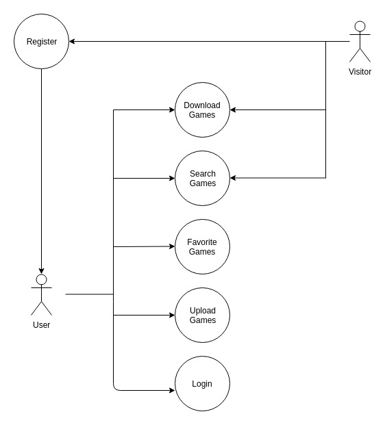
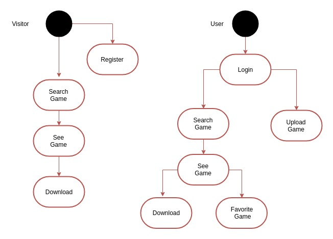
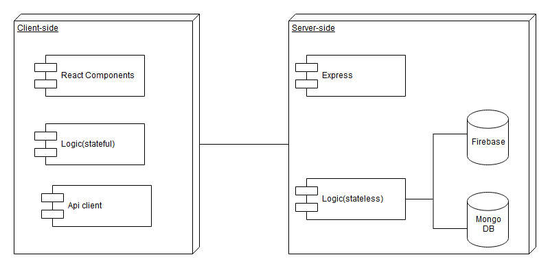
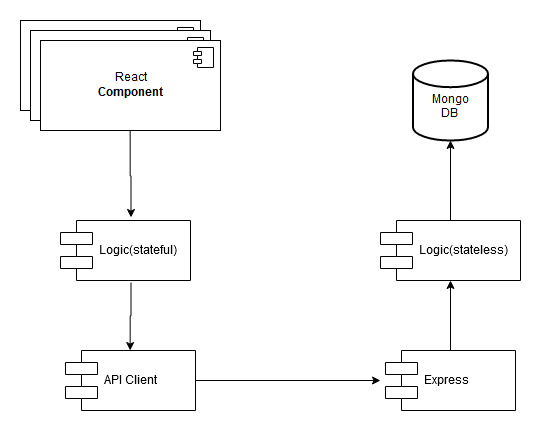
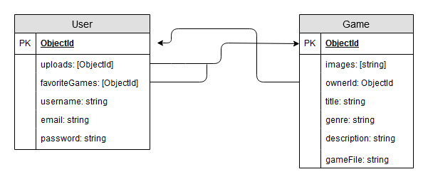
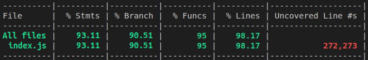
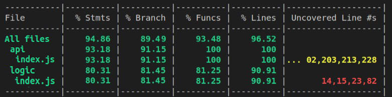

# FREENDIES

## Introduction
---
Freendies is a webpage to download free PC indie games.
 It also offers the oportunity for indie game developers to upload their games and share them with the community.

## Functional Description
---
<b>Visitors can:</b> 
- Download Games 
- Search Games by Genre or Title 

<b>Users can:</b> 
- Download Games 
- Upload Games 
- Search Games by Genre or Title 
- Save Games they like in their Favorite List

## Use Cases

---
## Flow Charts

## Blocks

## Components

## Data Model

# Code Coverage

API Coverage

APP Coverage

## To Do
- Likes
- Game comentaries
- Edit Uploaded Games
- Edit Users
- Loading feedback

## Technologies
Javascript, ReactJS, Node.js, Express, MongoDB & Mongoose.