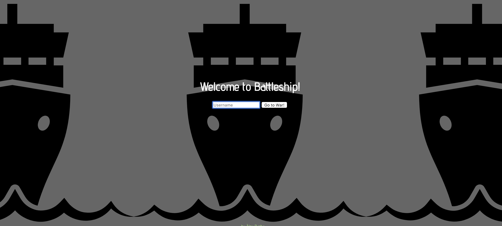
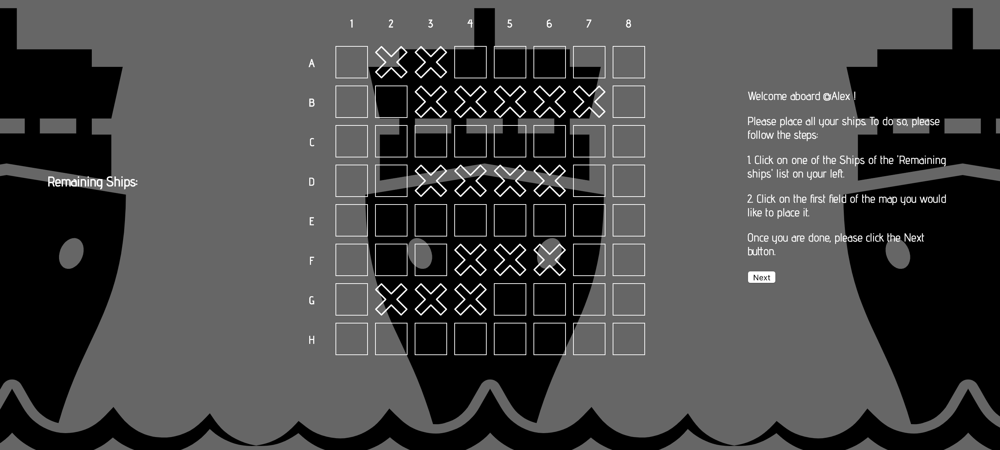
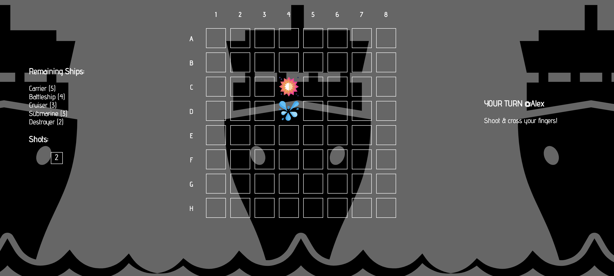
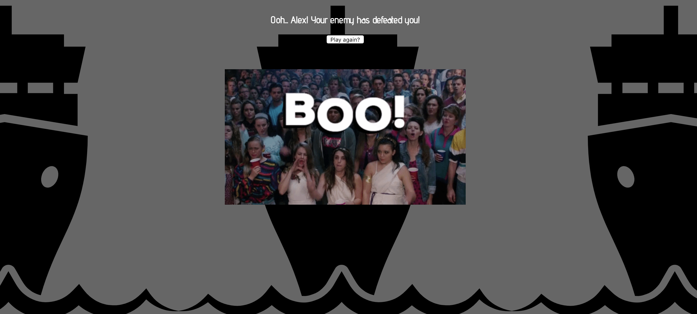
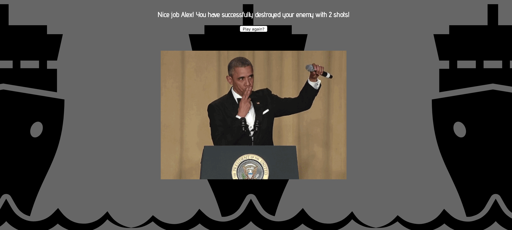

# Battleship

==============

## Introduction

Skylab Bootcamp Pre-Course Final Project - Battleship.

Copy of the original game "Battleship" created by Milton Bradley in 1967.

## Functional description

Objective: destroy the opponent fleet first.

1. You are required to sign in with a Username and click on `GO TO WAR`

2. You will be asked to place your ships.

3. On the next page, you will have to shoot the COMPUTERS ships.

4. By clicking Ctrl+Z, compuer wins.

5. By clicking Ctrl+B, player wins.

6. At the end of the game, you will be asked to play again.

### Use cases

Login 
Place Ships 
Shots 
AI wins 
User wins 

## Technical description

- Javascript
- HTML
- CSS