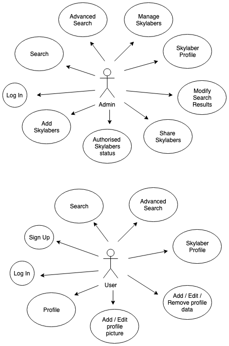

# SkyLab Inn App

## Introduction

Create a private network to connect all Skylabers, with the aim to:

SkyLab Academy: easily match the new Skylabers with the job offers requirements.

Skylabers: easily find out which Skylabers can help or assist them when in need of assistance, or easily get in touch with any of them.

## Functional description

Admins can:

* Add Skylabers to the whitelist.
* Check the status of this pre-authorised Skylabers(if signed up or pending email verification).
* Perfom regular or advance searches of Skylabers.
* Share hashed urls with contact information of the filteres Skylabers.

Only pre-authorised Skylabers can register to the network. Once they are added to the whitelist, the Skylaber recieves an email letting her/him know that he has been cleard to sign up. After registration, Skylabers receives and email to confirm her/his email address.

Skylabers can:

* Update their profile.
* Perfom regular or advance searches of Skylabers.

### Use Cases

## Technical Description

### Blocks

### Components

### Class / Objects

### Data Model

### Code Coverage

#### 

#### 

### Technologies
Javascript ES6, ReactJS, Node.js, Express, MongoDB & Mongoose.

