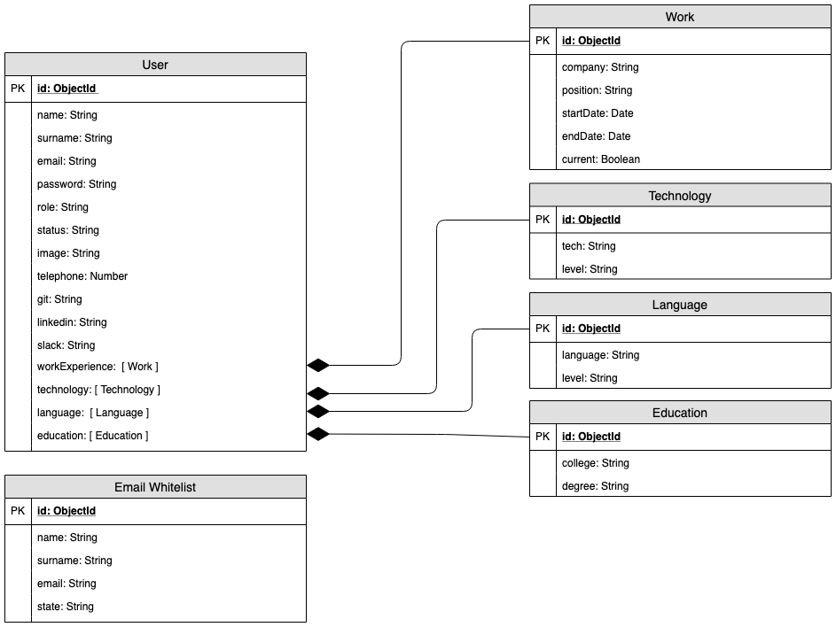

# SkyLab Inn App

## Introduction

Create a private network to connect all Skylabers, with the aim to:

SkyLab Academy: easily match the new Skylabers with the job offers requirements.

Skylabers: easily find out which Skylabers can help or assist them when in need of assistance, or easily get in touch with any of them.

## Functional description

Admins can:

* Add Skylabers to the whitelist.
* Check the status of this pre-authorised Skylabers(if signed up or pending email verification).
* Perfom regular or advance searches of Skylabers.
* Share hashed urls with contact information of the filtered Skylabers.

Only pre-authorised Skylabers can register to the network. Once they are added to the whitelist, the Skylabers recieve an email letting them know that they have been cleared to sign up. After registration, Skylabers receive and email to confirm their email addresses.

Skylabers can:

* Update their profile.
* Perfom regular or advance searches of Skylabers.

### Use Cases

### Flowcharts

#### Admin

#### User

#### Guest

## Technical Description

### Blocks

### Components

### React Components

### Data Model

### Code Coverage

#### 

#### 

### Technologies
Javascript, ReactJS, Node.js, Express, MongoDB & Mongoose.

