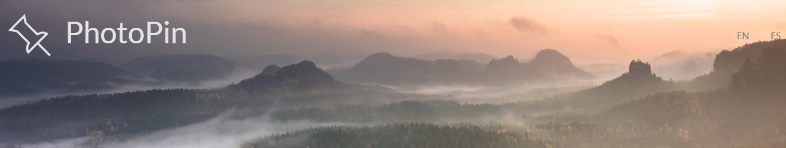
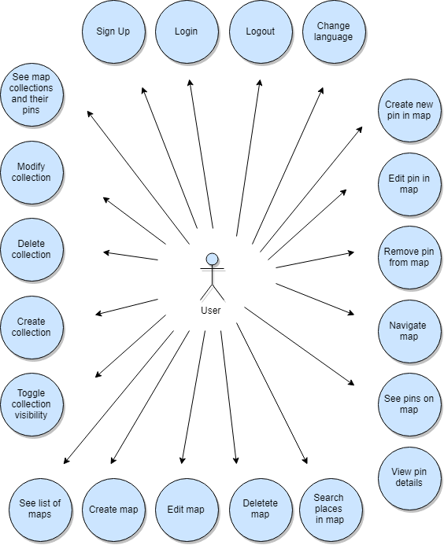
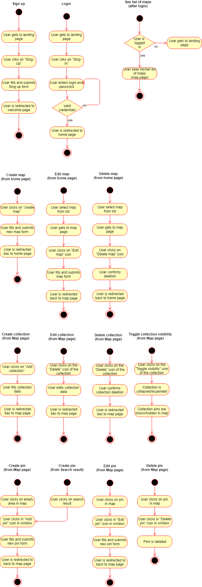
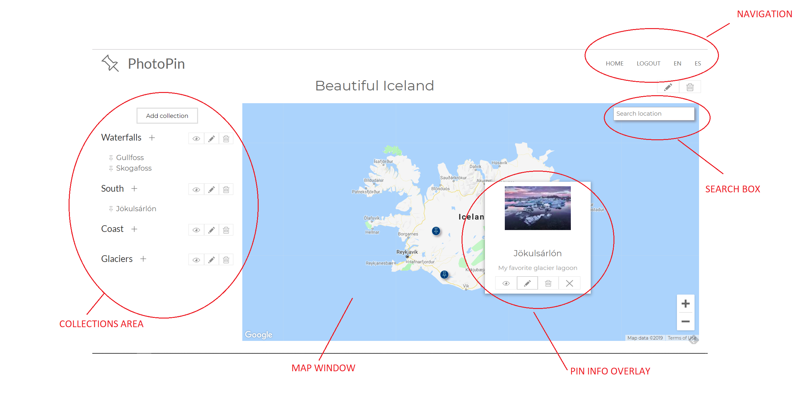
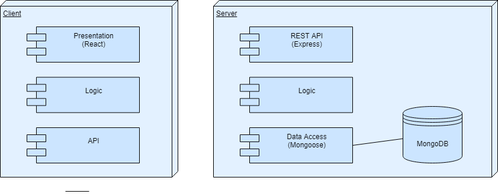
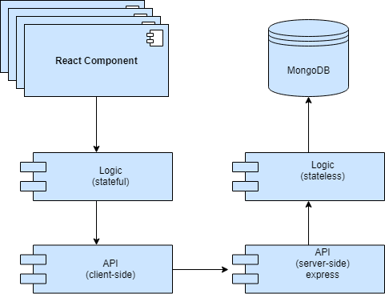
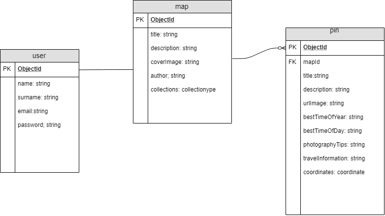

# Introduction:

Photopin is an tool aimed at professional and enthusiast photographers who require careful planning of their photographic trips, as well as an easy and visual way to keep track of their favorite photographic locations.

The application allows users to create their own maps and populate them with collections of locations. For each location, users can store valuable information and reference images that will help them assess the best time and conditions for a successful photographic session.

# Functional Documentation

## Use Cases

## Flows

## Main Interface (Map page)

# Technical documentation

## Design

### Blocks

### Components

### Data Model

## Project structure

This application contains the following modules:

- **photopin-api**: server-side node/express app (additional info [here](../photopin-api/README.md))
- **photopin-app**: client-side react app (additional info [here](../photopin-app/README.md))
- **photopin-call**: client-side helper to issue calls to the server
- **photopin-data**: data schemas (mongoose)
- **photopin-doc**: project documentation
- **photopin-errors**: common error definitions
- **photopin-normalize**:  common helper functions
- **photopin-validation**: common validation logic

## Project set up

### Requirements

- Node.js
- MongoDB server

### Configuration

- See client-side configuration in the [photopin-app specific docs](../photopin-app/README.md))
- See server-side configuration in the [photopin-api specific docs](../photopin-api/README.md))

## Technology stack

This application has been built using the following main technologies
- React.js
- Node.js
- MongoDB

In addition, it does intensive use of Google's Maps and Places apis

### Code Coverage

