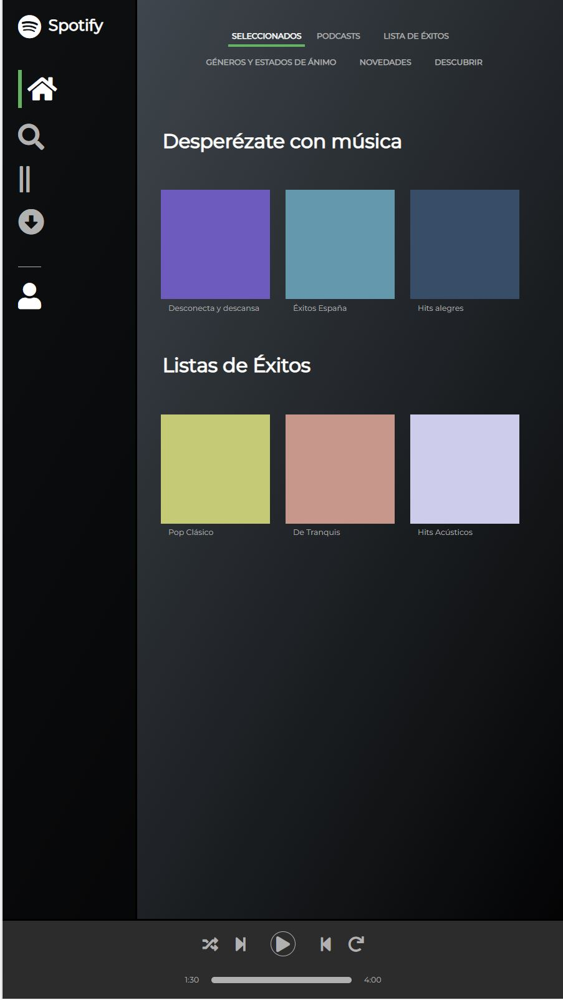
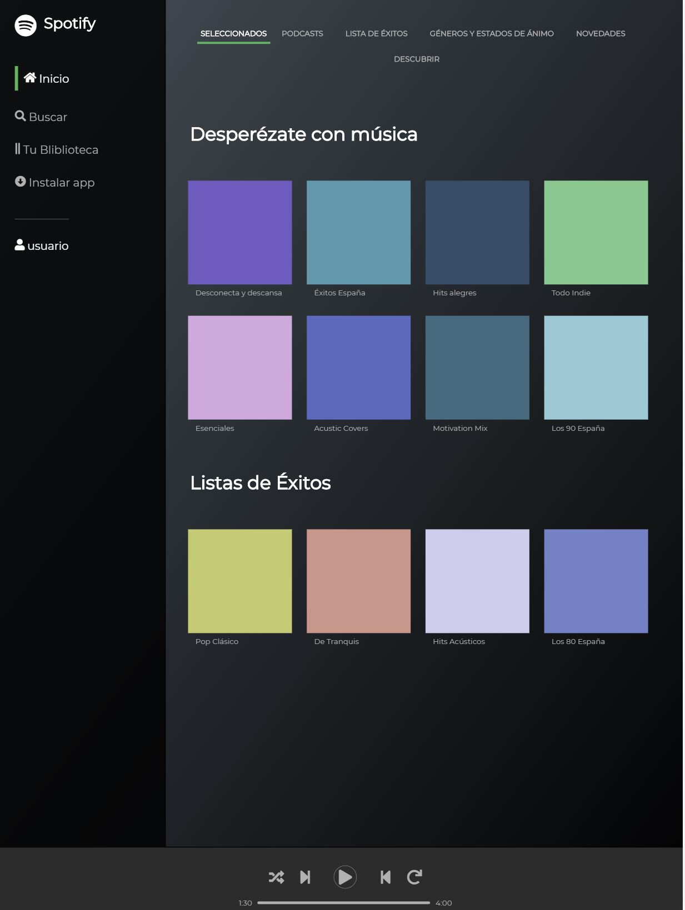
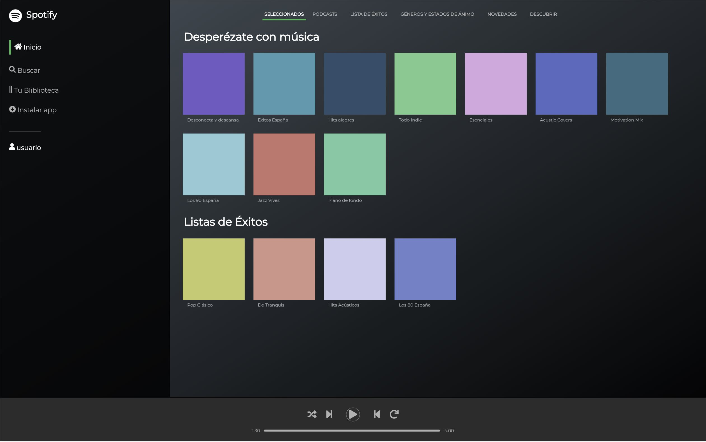

# CHL Spotify template

A Spotify template with HTML and SASS (applying BEM)

## Original description

* feature/spotify-template
* locate files in staff/name/spotify-template (index.html and style.css)
* create the template of spotify web (htts://open.spotify.com)
* use ONLY html and css (semantically correct)
* it MUST be mobile first, and it MUST support tablet and desktop viewports
* HINT for symbols https://fontawesome.com
* MUST use BEM and Sass

### Mobile version

### Tablet version

### Laptop version

