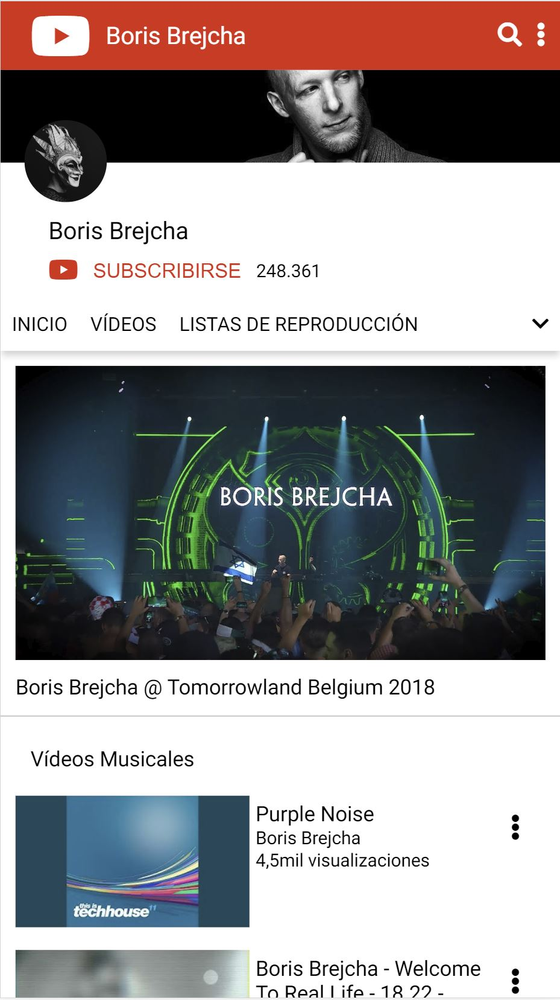
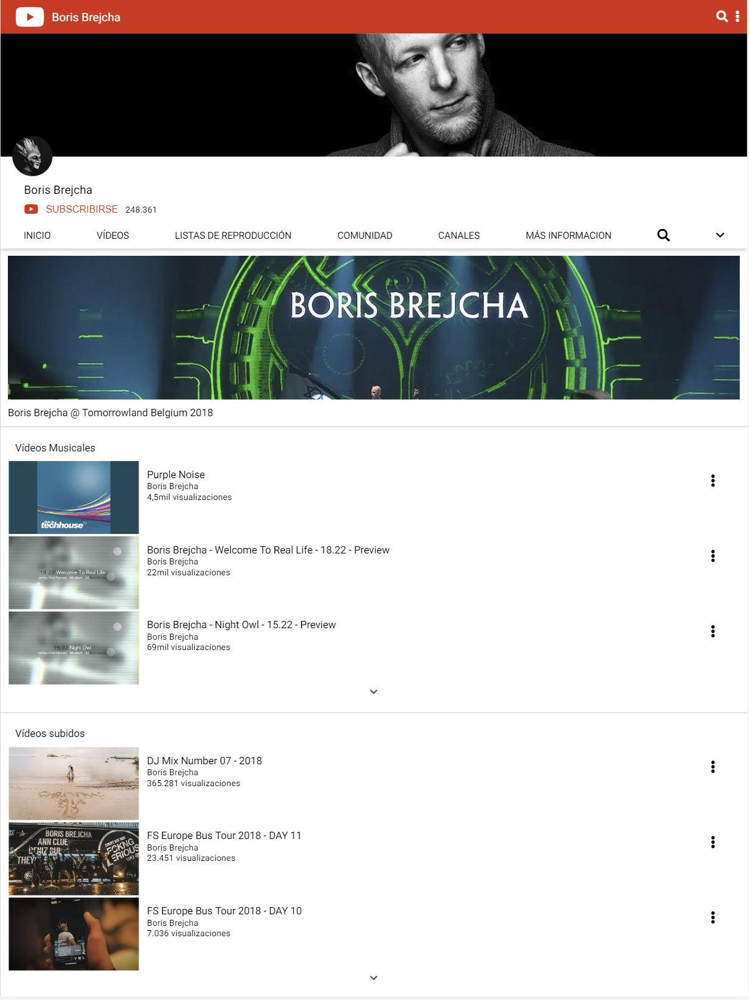
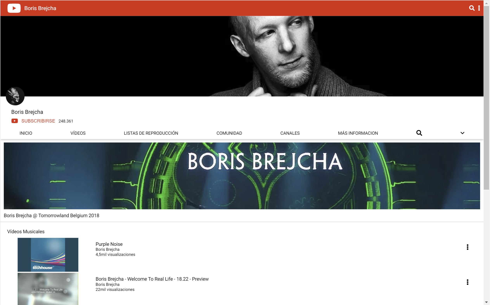

# CHL Youtube Channel template (mobile version)

A Youtube Channel template (mobile version) with HTML and CSS.

## Original description

* feature/youtube-channel-template
* locate files in staff/name/youtube-channel-template (index.html and style.css)
* create the template of a youtube channel (ex: https://www.youtube.com/channel/UCukezONa4veoJBeK9UuVZew)
* use ONLY html and css (semantically correct)
* it MUST be mobile first, and it MUST support tablet and desktop viewports
* HINT for symbols https://fontawesome.com

### Mobile version

### Tablet version

### Laptop version

