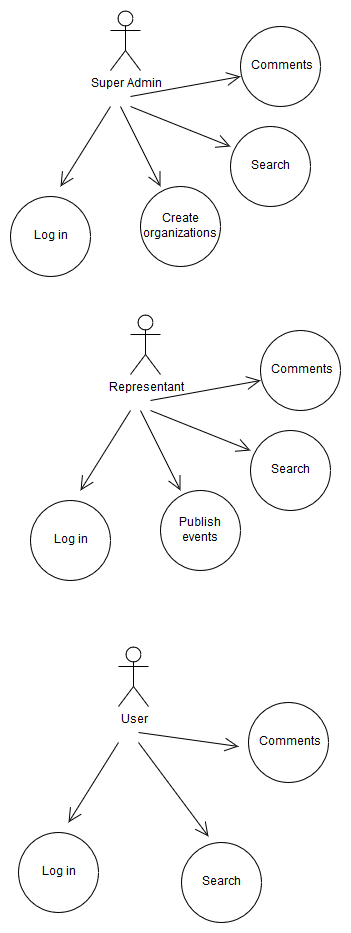
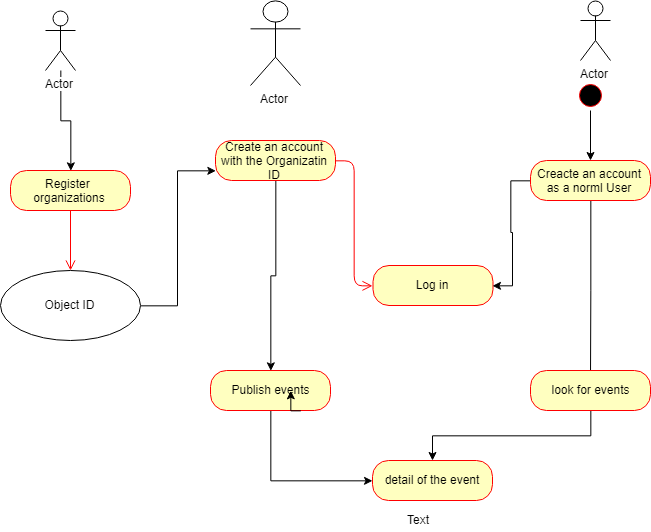
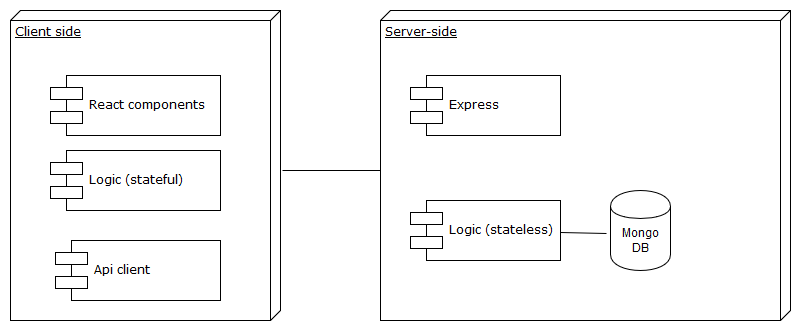
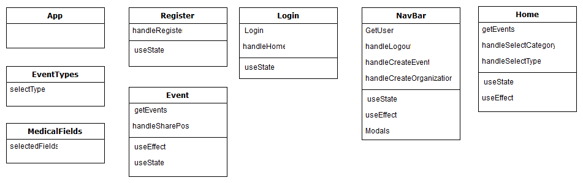
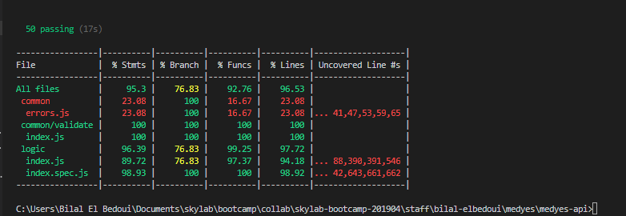

# MEDYES

## Introduction

This app allows to the representants of different organizations to publish medical events, to inform the different users (students and doctors...) that are working in the sector

## Functional Description

### Uses Cases

### FlowChart

## Technical Description
### Blocks

### Components

### React compomenents

### Data Model

### Coverage API

###Technologies
Javascript, React (Hooks), Node JS, Express, Mongoose and MongoDB

### To Do

- I still need to test the app methods
- To improve the styles

### Next funcionalities

- To be able to but ticket througth the app
- add more funcionalities for the users

