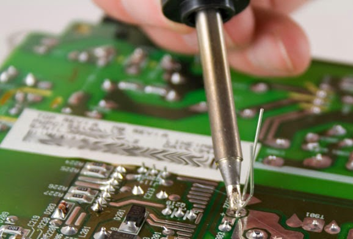
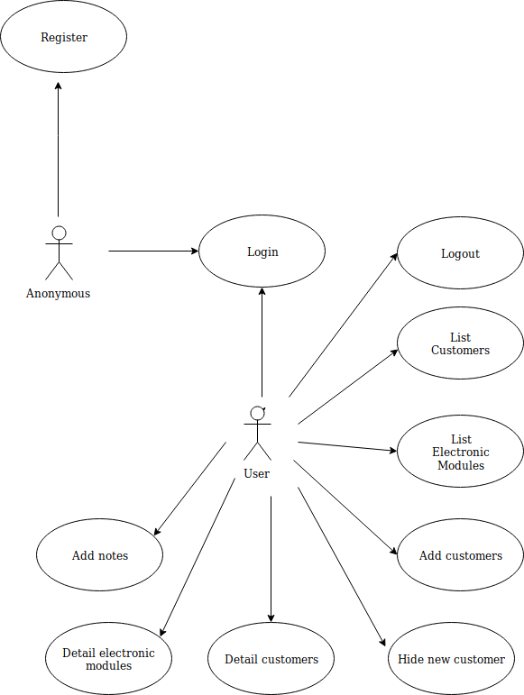
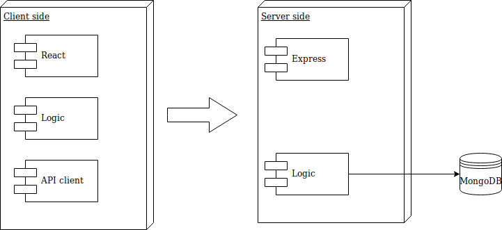
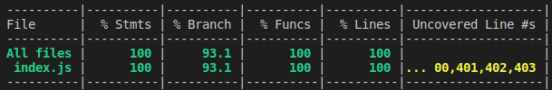

# `CF - MCE App`

## `Flow control of electronic control modules`

## Introduction

"Flow control of electronic modules" is a web-app that alowes to storage and manage data of customers and theirs devices, so makes easier to track orders, items, and deliveries. 

## Functional description

 Users can:

* Register customers.
* Register electronics modules linked to customers.
* Add notes linked to customers
* Show customers and electronic modules details.

### Use Cases

## Technical Description

### Blocks

## [Planning]()

#### Proyect developer

* [Carlos Corredor](https://github.com/Carlos7979)

### Api coverage

