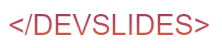
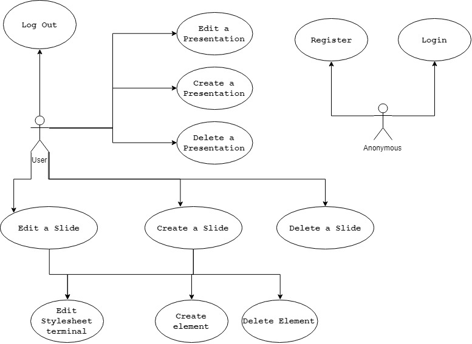
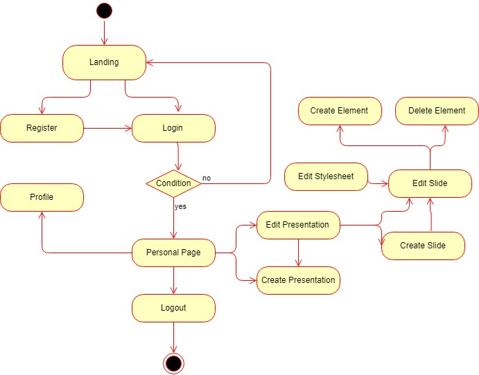
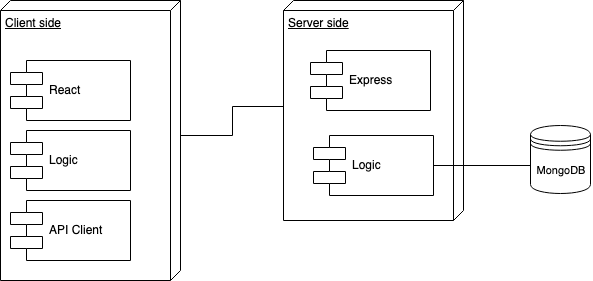
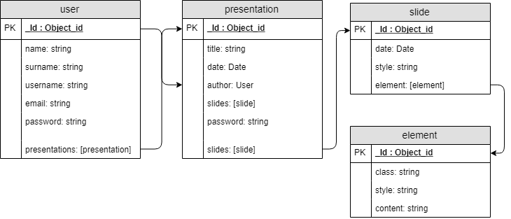
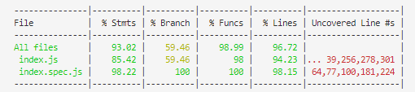

# 

 
 
 
 

## Introduction

Devslides is a platform for making presentations with your coding skills, that gives you more control of your presentation slides just like making a classical html/css website

Create a presentation and make many slides you desire, each one with its own css3 stylesheet

## Functional Description
Users can:

* Create Presentations

* Create Edit and Delete Slides from existing Presentations

* Create elements inside each slide witch you can modify with css

* Save your presentations

* Modify your profile
### Use Cases

### Flows

## Technical Description

### Blocks

### Components

### Data Model

### Code Coverage

* * * * * * * * * * * * *

