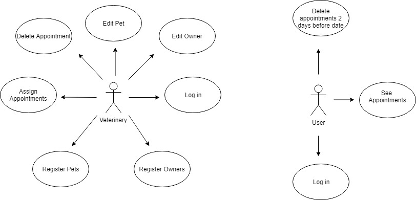
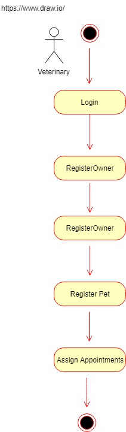
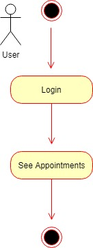
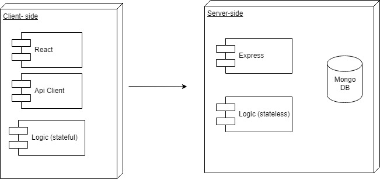
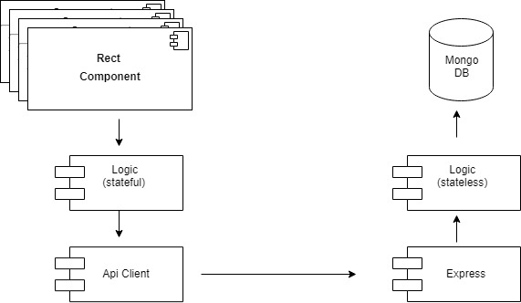
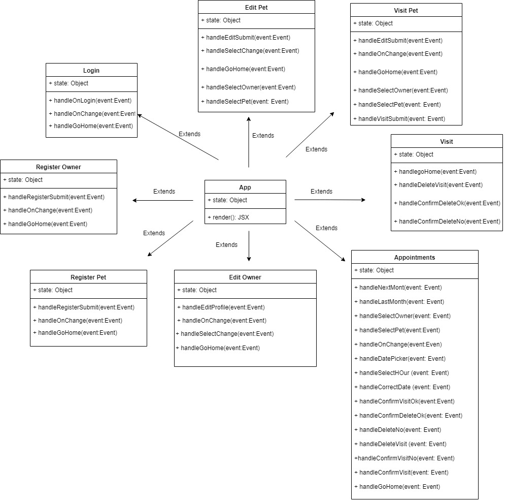
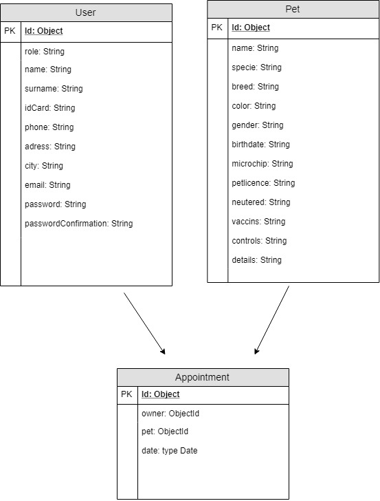
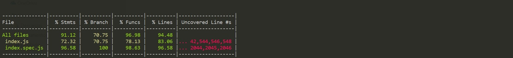
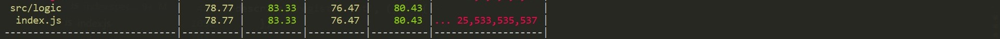

# St-James-vet 

___

## Introduction

Application to manage owners and pets of a veterinary clinic.Veterinarian registers owners and their animals, can modify their profiles and add information for each visit. Veterinarian can also assign appointments to owners. 
Owners can see their appointments and delete only the appointments two days before the day.

## Functional description

Admins can:

-Register owners and their pets, update their profiles, assign appointments and update visit's information (details, controls, vaccins....)

Clients can:

-See their appointments and delete only the appointments two days before the day.

### Use cases

### Flows

#### Admin

#### Client

## Technical description

### Blocks

### Components

### React Components

## Data model

## Code Coverage

### Api

### App

## Technologies

