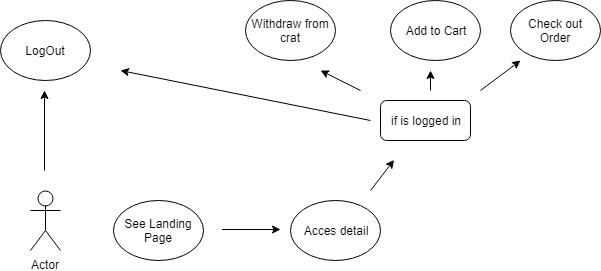
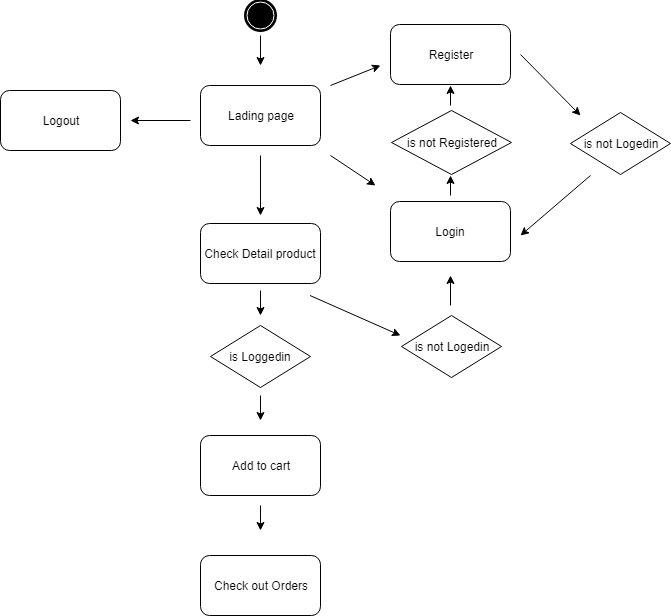
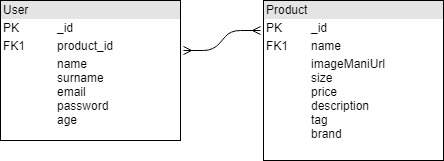
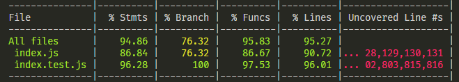

#Pro-Skate App

## Functional Description

Users can:

* Check detail products
* Buy and pay with credit card if the are logged in

* Save their orders in case they want to buy items later

### Use Cases

### Flow

## Technical Description

### Blocks

### Components

### Data Model

### Api Coverage

### Tecnology stack

 
 
 

