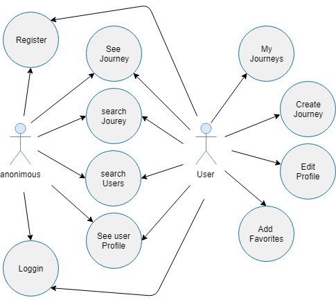
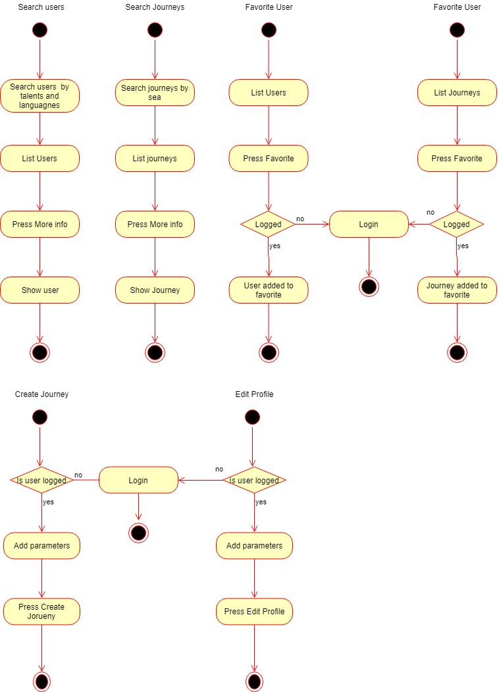
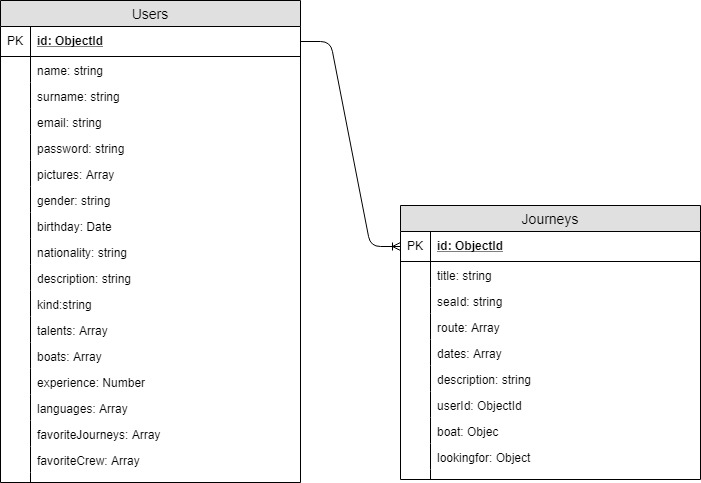

# SAIL AWAY

## Introduction

The application welcomes the user by showing two main options to search. The user can search by journeys or crew. They fins journeys by sea and crew by the talents they have and lenguages they speak.

you do not need to be logged to navigate, however if you want to have favorites, create a trip or contact with someone it would redirect to make login or register.

Once the user is logged it can edit its profile to find the best match and creates journeys to atract people to join their adventures

## Functional Description

### Use Cases

### Flows

## Technical Description

### Blocks

### Components

### Data Model

### Technologies

### Code Coverage

