# Gelato App

## Introduction
Create your own ice cream choosing the size, type and flavors. Pay for the ice cream on the web and receive a qr code with which you can go to your nearest Gelato store to retrieve your order.

## Functional description

Admins can:
- Manage all the orders
- delete orders 
- Create Events for the home page
- Delete Events

Users can: 

- Create an order
- Delete an order
- Pay an order
- Check the Store map 
- Check Qr Code
- Update Profile
- Delete account

## Use cases

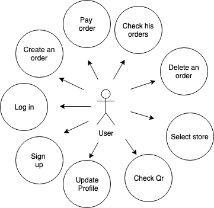
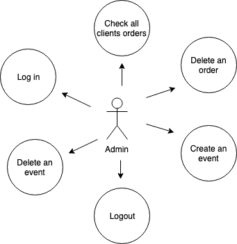

## Flowcharts

## Admin
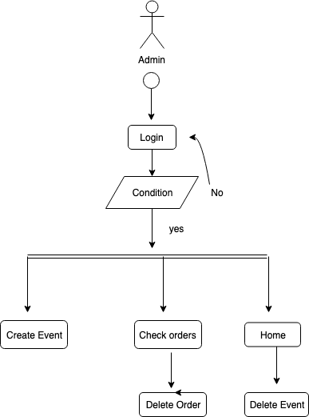

## User

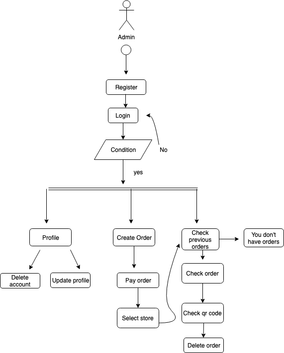

## Guest

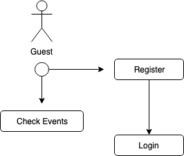

## Technical Description

Blocks

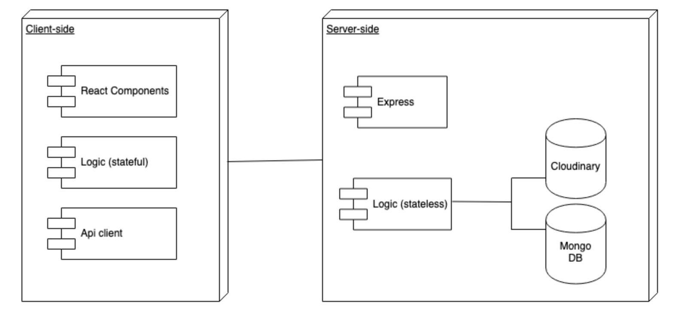

## Components

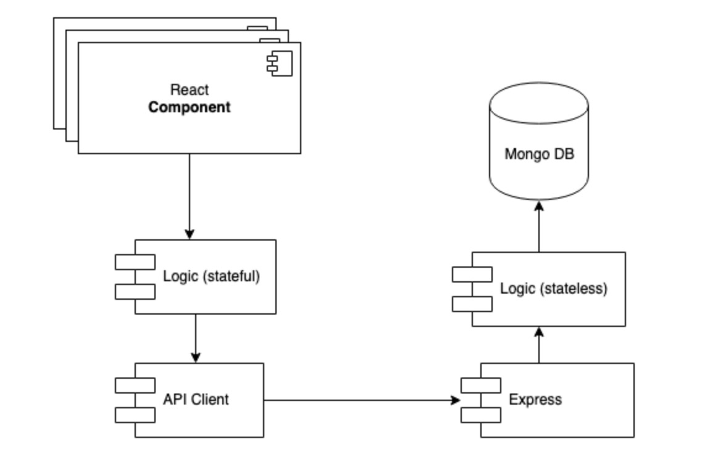

## React Components

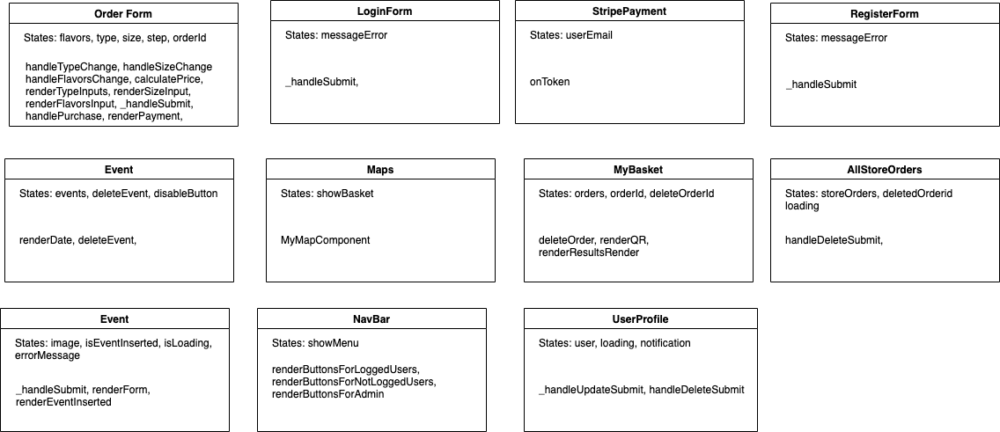

## Data Model

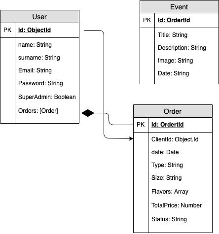

## Code Coverage

Api Coverage

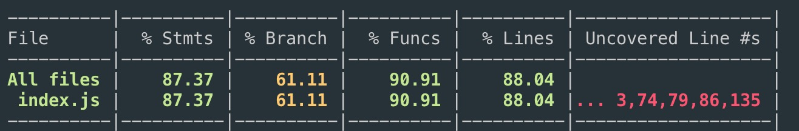

App Coverage

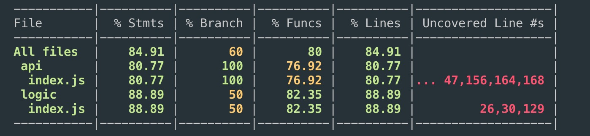

## Technologies
Javascript, ReactJS, Node.js, Express, MongoDB & Mongoose.