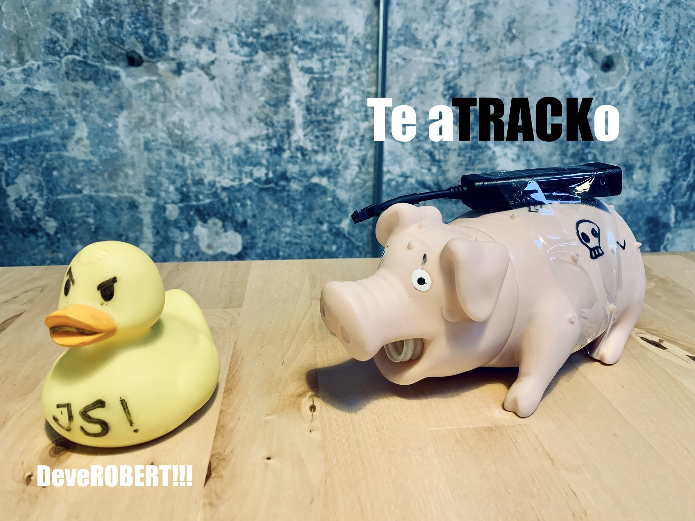
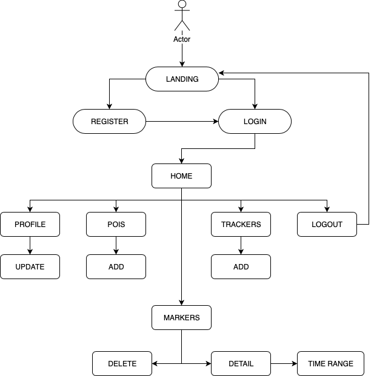
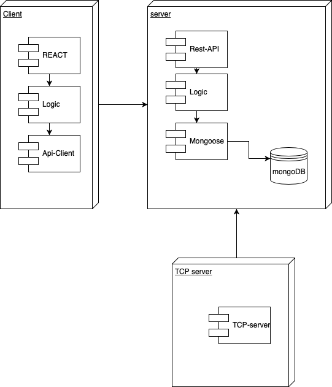
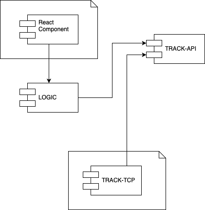
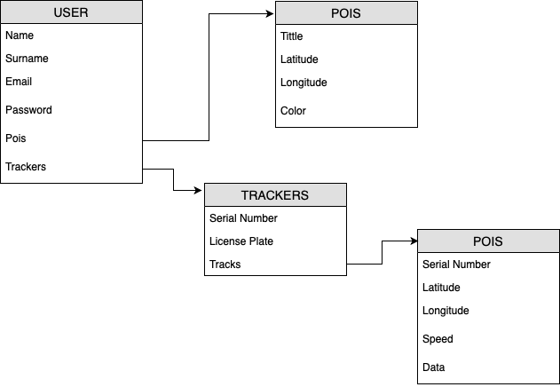
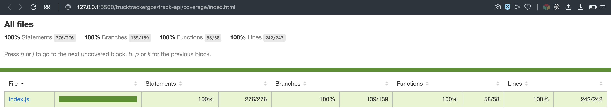

# **T**or**T**oise **GPS**
---
### 🚚 - Truck Tracking - 🛰
---

## Introduction

**TorToise GPS** is a web application that shows the location of a GPS device in real time. In this case, focused on truck tracking.

## 🚛 Environment Setup

- Install the needed tools

- Clone this repository: git clone https://github.com/didactor91/skylab-bootcamp-201904.git

- Move to your project folder: cd skylab-bootcamp-201904/staff/didac-torres/tortoise-gps

### To run client side

- Go into track-app

- Copy the default environment variables: cp .env.dist .env

- Open .env and edit with yours API credentials

- Install dependencies $ npm install

- Start the services: $ npm start

- Go to the [Developement Mode](http://localhost:3000)

### To run server side

- Go into track-api

- Copy the default environment variables: cp .env.dist .env

- Open .env and edit with yours config (listen PORT, and url to mongoDB)

- Install dependencies $ npm install

- Run a mongoDB

- Start the services: $ node .

### To run TCP server

- Go into track-tcp

- Copy the default environment variables: cp .env.dist .env

- Open .env and edit with yours config (listen PORT, url to your REST-API)

- Install dependencies $ npm install

- Start the services: $ node .

*YOUR SERVER NEEDS A STATIC PUBLIC IP AND PORTS OPEN*

### To run DEMO TRACKERS

- Go into tracker-simulator

- Copy the default environment variables: cp .env.dist .env

- Open .env and edit with yours config (url to your TCP server)

- Install dependencies $ npm install

- Start the services: $ node .

### To run TRACKER-GPS

- Power ON your GPS device, wait to connected led signals

- Send Code to GPS with your TCP server IP and PORT

- Wait to response: SET OK

## Functional Description
### User Cases

## Technical Description
### Blocks

### Components

### Data Model

## Code Coverage

## [Live Demo](http://tortoise-gps.surge.sh)

*Live Demo runs on Heroku Server, please be patient at first login attempt*

## Next Features

- List of Trackers with Location (POIS)
- Update POI INFO
- Search POIS by Title
- Update Trackers INFO
- Search Trackers by License Plate
- Search Trackers by Serial Number
- Tracker Alerts based on POIS location
- Add more GPS Data Protocols (now only supports H02 )
- Add a Serial Number BlackList to denegate connections