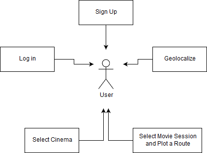
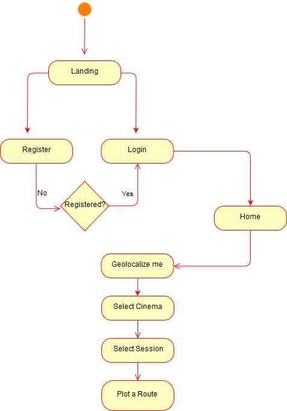
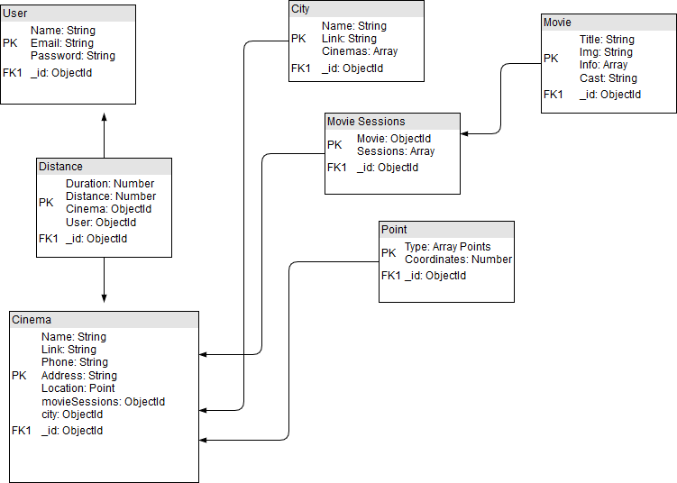
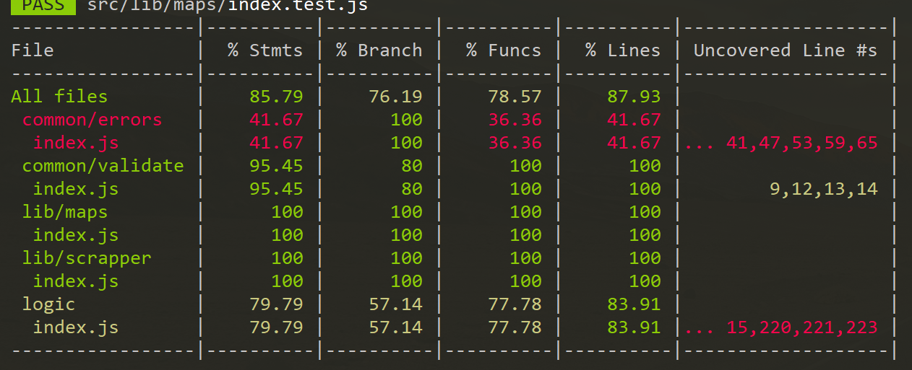

# Cinema And Go

## Introduction


```Cinema And Go``` is a platform where you can geolocate yourself and see which are the closest cinemas to you and which sessions you are able to rech and enjoy.

## Description

Users can:
- Get registered
- Locate themselves into their area with Google Maps API
- Find the closest cinemas to them
- View all the movies and their sessions
- Pick a session that they are going to be able to reach
- See the quickest route to reach the cinema


[Follow this link to see the Trello for the project](https://trello.com/b/CFbg97oq/cinema-and-go)

## Mock ups
---

[Landing Mobile](https://codepen.io/edofris/pen/joKzPg)
[Register Mobile](https://codepen.io/edofris/pen/MdXmbL)

## Use cases
---



## Flowchart
---



## Tech description
---
### Blocks


### Components


### Data model



## Coverage
---


### Technologies

Javascript, ReactJS, Node.js, Express, MongoDB & Mongoose, Google Maps.