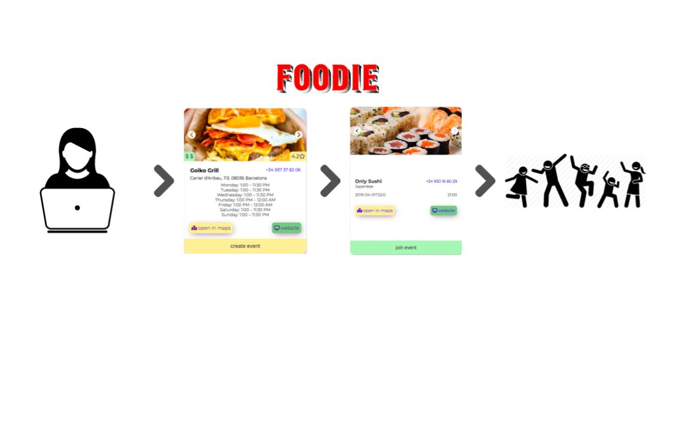
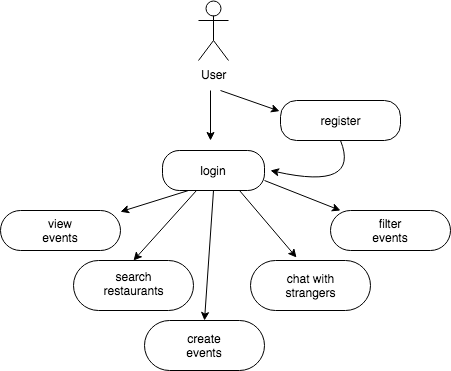
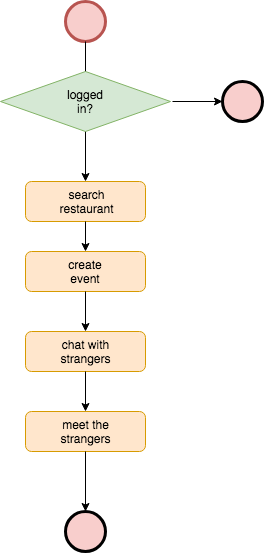
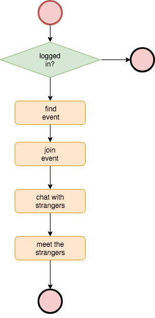
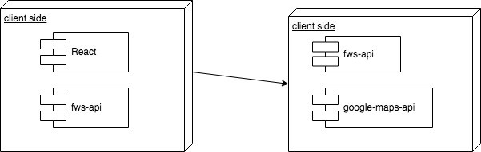
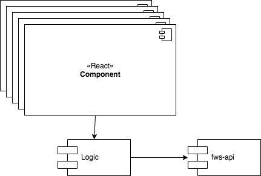
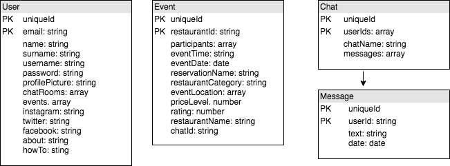
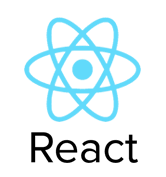
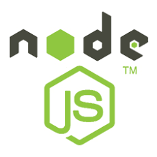
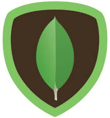

# FOODIE

 
## Introduction

FOODIE is a web app developed with [React](https://reactjs.org) and [Node.js](https://nodejs.org) that allows users to create and assist already created events to eat with strangers.

## Environment setup

### Install the needed tools
* Clone this repository: `git clone https://github.com/robert-z/skylab-bootcamp-201901.git`
* Move to your project folder: `cd skylab-bootcamp-201901/staff/emma-cowdery/fws`
* Start the services: 
    * `$ yarn start` for fws-app
    * `$ yarn atart` for fws-api
* Go to the [development mode](http://localhost:3000)

## View

## Functional Description

### Use Cases

### Flows

#### Create event

#### Join event

## Technical Description

### Blocks

### Components

### Data Model

## Technologies
### React

### Node

### Java Script

### Mongodb

### Code Coverage

