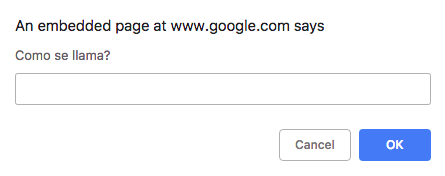

# AEROLINEA

## - INTRODUCCIÓN
Interfaz de usuario para una aerolinea que muestra diez vuelos diarios.

## - COMO USAR

Al ejecutar el programa la consola le preguntara que introduja su nombre de usuario.

A continuación se le mostrará la información de los vuelos del dia de hoy.