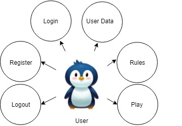
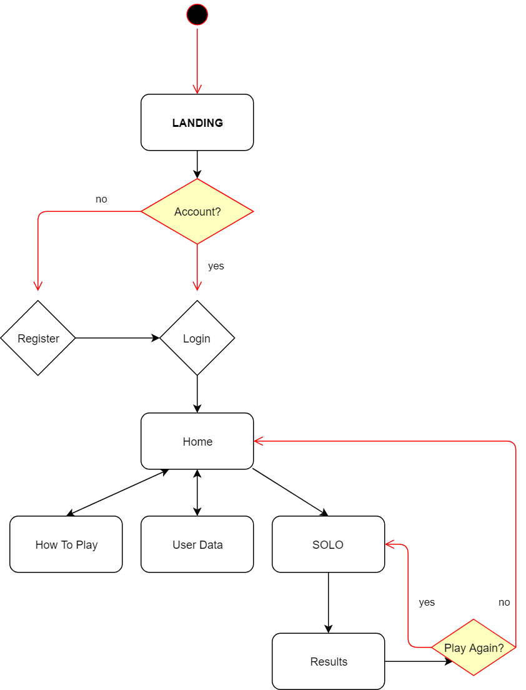
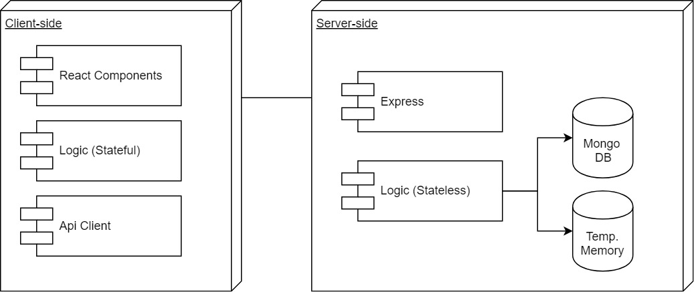
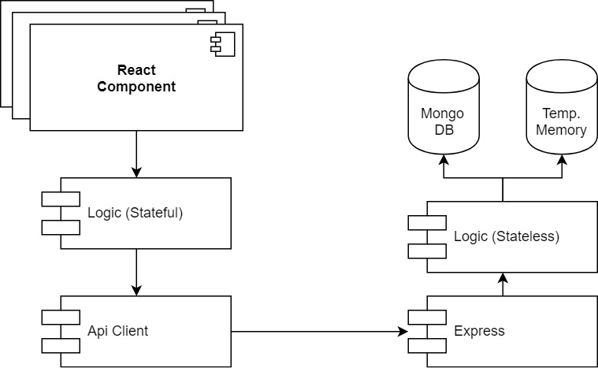
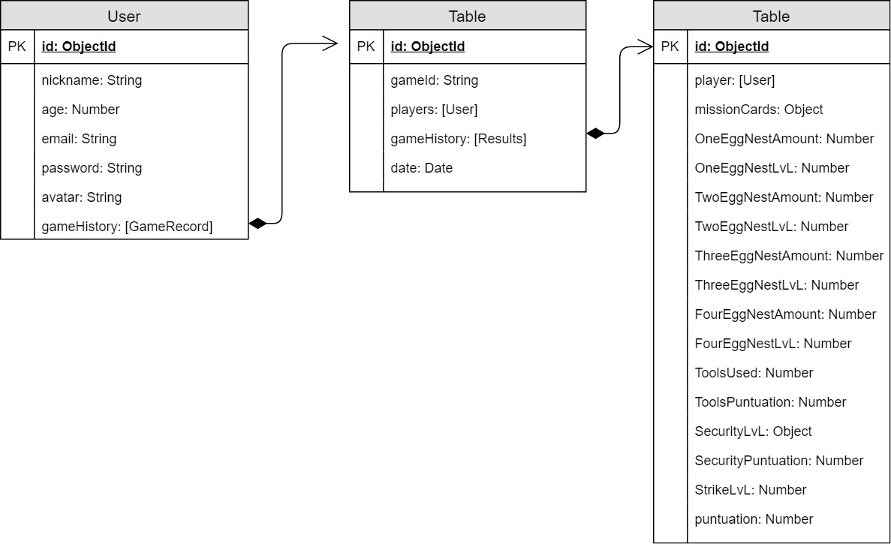
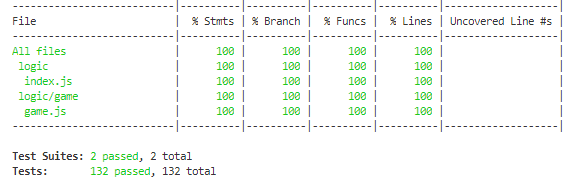
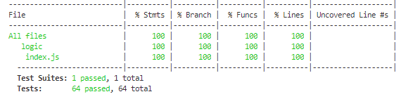

# Project name: Breeding Season

A game were you will have to help penguins to breed!

## APP DESCRIPTION

In this first version you will be able to play Breeding Season on Solo Mode. In future updates the Multiplayer version will be added.

## Functional description

### Use cases

 ### Flows

## Technical description

### Blocks

### Components

## Data model

##TODO

    · Move the Game Instance from Memory to DB
    · Make the APP work on Multiplayer (API already able to carry it).
    . UI improvements

### Technologies

React Js, ES6, Mongo, Mongoose, Express, Bulma

## Code Coverage

### API
 

### APP
 

