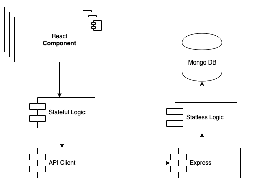

# Flare app

## Introduction

Flare is a platform that allows users to send messages based on geographical location and time. We invite you to register and try it out.

Choose a user, add a text and an image to the message, select the date from which the message will be available and send it! The recipient will get your flare once located in the message position.

## Functional description

Users can:

* Create a message specifying the recipient(other users of the platform), text, image(optional), launch date and position.
* Check and/or edit their profile.
* Enter watch mode to look for messages received.
* Read messages(in case they match the message's position).
* See flares map with all messages sent through the platform.
* See and/or delete all messages they've sent.

Only registered users can access the platform's content.

### Use Cases

## Technical Description

### Blocks

### Components

### React Components

### Data Model

### Code Coverage

#### 

### Technologies
Javascript, ReactJS, Node.js, Express, MongoDB & Mongoose.

