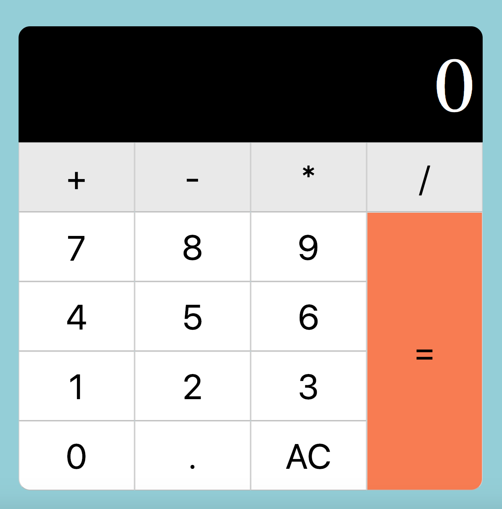

Calculatorpro
=========

## Introduction

Calculatorpro app is a calculator in your browser.

## Functional description

Calculator app can do the following operations:

1. Sum
2. Subtract
3. Multiply
4. Divide

### Use Cases 

User can introduce the numbers he wants and do the operations he wants.

## Technical description

Calculator app is built using HTML, CSS and Javascript Vanilla.