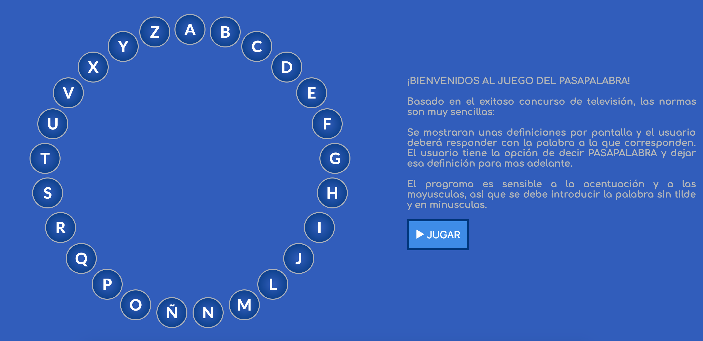

Pasapalabrapro
=========

## Introduction

Pasapalabra app is a simple way to play pasapalabra in your browser.

## Functional description

Pasapalabra app starts when the users hits the button JUGAR. 

One after the other, the description (hint) of each letter appears. The user can write "pasapalabra" to skip the question or reply. If it's right, the letter turns green and if wrong red.

### Use Cases 

There are no different option for the user to interact with the app. 

## Technical description

Pasapalabra app is built using HTML, CSS and Javascript Vanilla.