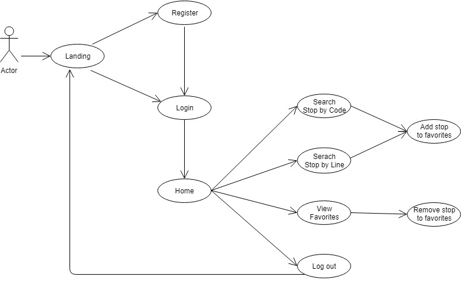
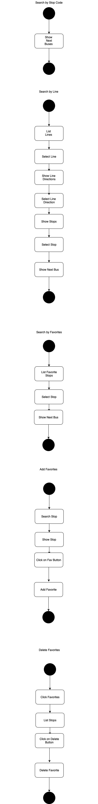
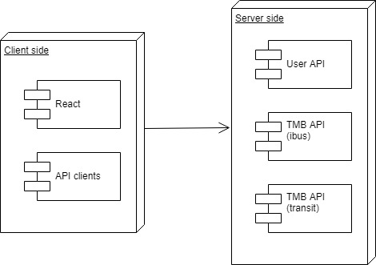
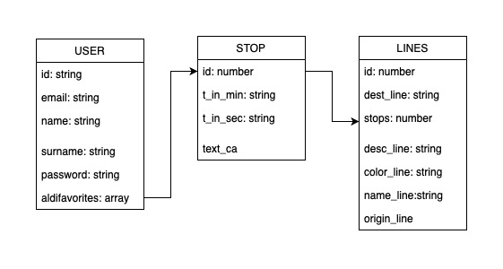
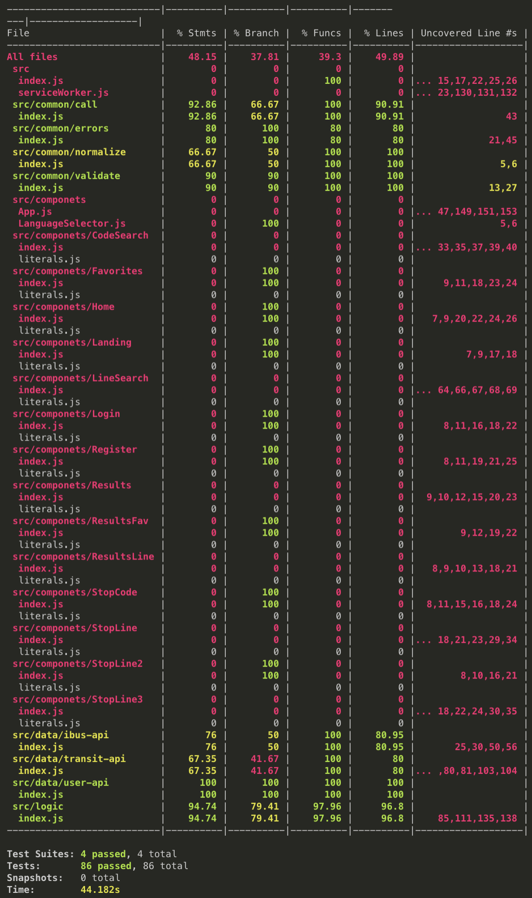

# SIEMPRE TARDE

## Introduction:

Siempre Tarde is a [SPA](https://en.wikipedia.org/wiki/Single-page_application) developed with [React](https://reactjs.org) that allows searches through the [TMB API](https://developer.tmb.cat/api-docs/v1). 

List an updated information of the buses that will pass through a bus stop, and keep a list of favorites.

## 🚍 Environment setup

### Install the needed tools

* Clone this repository: `git clone https://github.com/didactor91/skylab-bootcamp-201904.git`

* Move to your project folder: `cd skylab-bootcamp-201904/staff/groups/aldi/siempre-tarde`
* Copy the default environment variables: cp .env.dist .env
* Open .env and edit with yours API credentials
* Install dependencies `$ npm install`
* Start the services: `$ npm start`
* Go to the [development mode](http://localhost:3000)

## Functional Description

### Use Cases

### Flows

## Technical Description:

### Blocks

### Components

### Data Model

### Code Coverage

