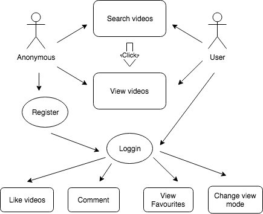
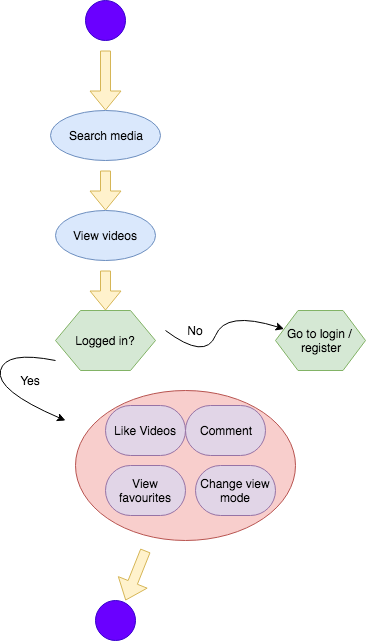
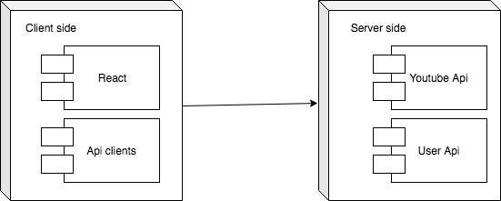
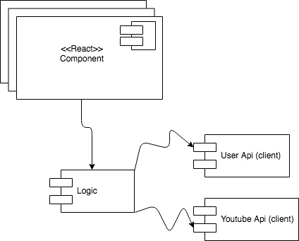

# Tutubo-App React-Scripts

## Introduction

TuTubo app is created using React Js, ES6 and the yourube v3 Api. Built by a team of two.

## Functional Description

### Use Cases

## Flows

### List Albums

## Technical description

### Blocks

### Components

### Class/Objects

### Technologies

 

### Code Coverage

