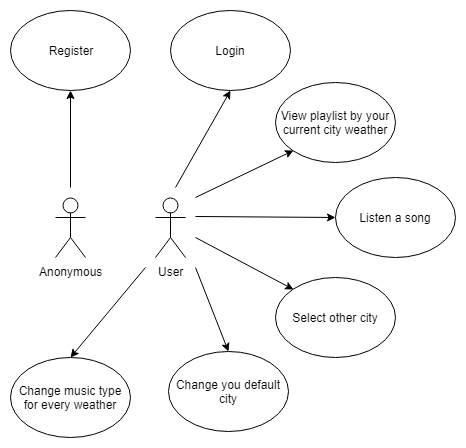
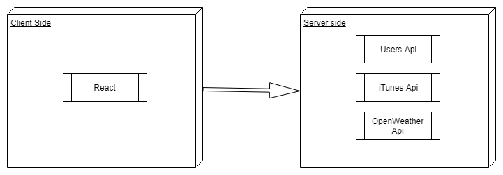
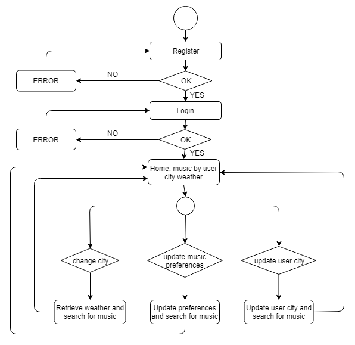
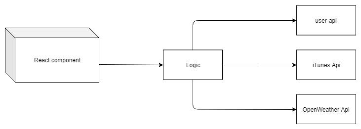
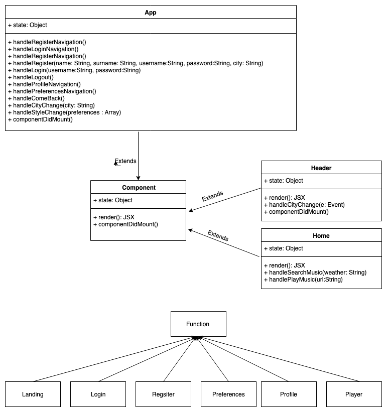

# Weatunes


## Introduction
```
Weatunes app will proposes you a playlist based on the weather of the selected city.

Once you register, you could choose your city and customize you music preference in every weather condition. on the next log in, Wtunes will show you directly the playlist based on the weather of your city.
If you move from your city, you could change you default city in any moment.
```


## Functional Description

### Use Cases



## Technical Description

### Blocks



### Flows



### Components



### Class / Objects




