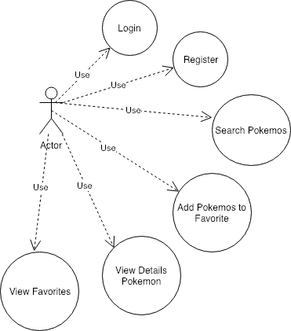
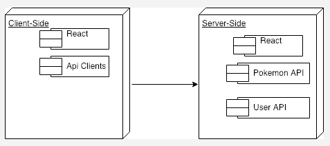
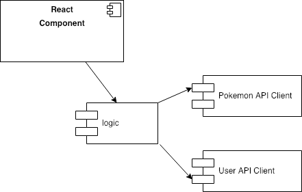
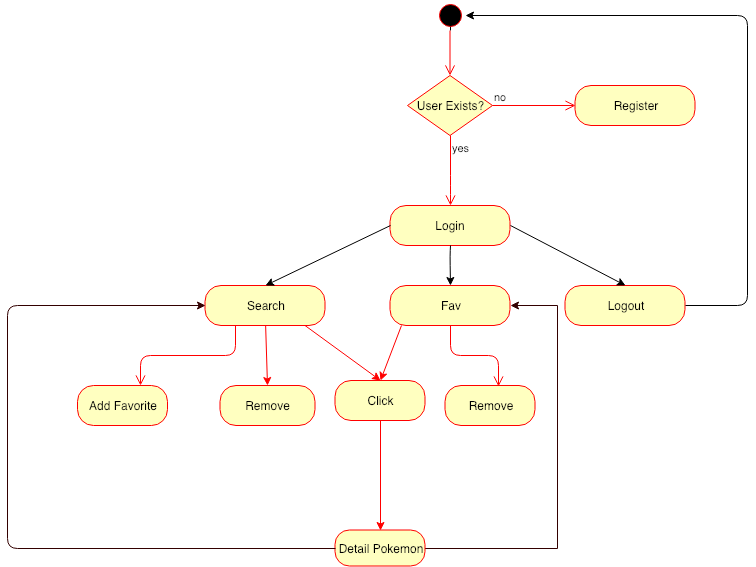
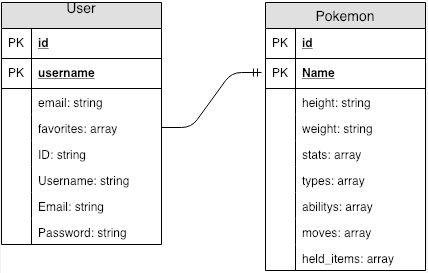
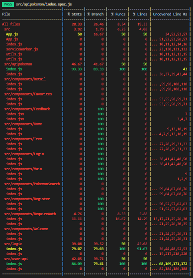

# Technical doc

This document describes technically funciton pokedex

## Functional description

The application welcomes the user by showing two main options, login a register.
If the user exists, it may login. In case it does not exist, it should register previously.

#### Login
As soon as the user has logged in, userId and token are stored in sessionStorage.

### Home

As soon as the user has logged in.
The application has three main options:
* Logout
* Search
* Favorites

#### Logout

Logouts the application. User Id and token are removed from sessionStorage.

#### Search
It allows to search a pokemon by name, the results are shown below. User may scroll if necessary.

#### Favorites
It allows to display a list of your favorite pokemon.

### PokemonCard

PokemonCard has four main parts.
* Card
* Display of the pokemon
* Pokemon Name
* More
    * Allows to see the detail of the pokemon (it also works clicking over card.)
* Favorites icon
    * Allows to add/remove to favorites.

## Use cases

### Architecture

### Components

### Flow

### Data Model

##Testing

The application has automated test, so they may be run when necessary.
For example in case the application is evolved, test may be run.

The results of automated are shown below.

### Logic Test

Test the application logics.

### Pokemon API

Test the data extraction from the API. The main tests are:
* SearchAllPokemon
* SearchPokemonByName

More info at: <https://pokeapi.co/>                 

### User API

Test the interaction between the application and user manager.The main functionalities tested are:
* Registering a user
* Authentication
* Retrieving data from a user
* Updating data from a user
* Removing data from a user

