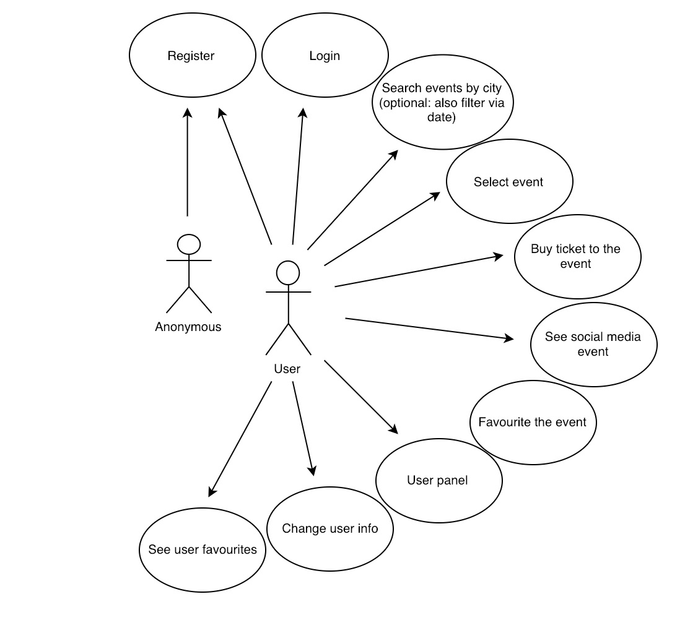

# Ticket-App 

## Introduction

Ticket-app allows users to find the best plans in their city. Concerts, Sports or Theaters, all kind of events can be found with a few clicks.

## Functional Description

Users have to register in order to use the app. Once they log in, they can search for events, see the details and/or add them to favourites and buy tickets. From his personal area, he can modify his profile info or go to favourites to check his best picks.

### Use Cases

### Flows

#### List Events

## Technical Description

### Blocks

### Components

### Class / Objects

### Data Model

### Technolgies

React JS, ES6, Sass, JEST, NPM, Bulma

### Code Coverage

