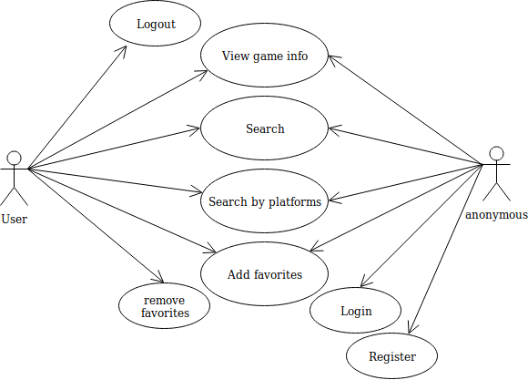
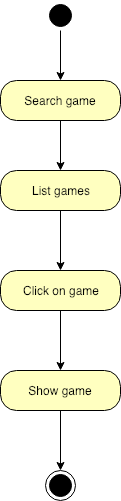
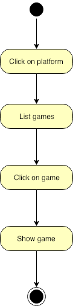
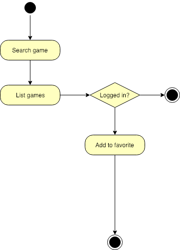
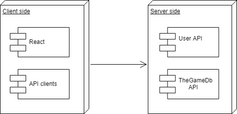
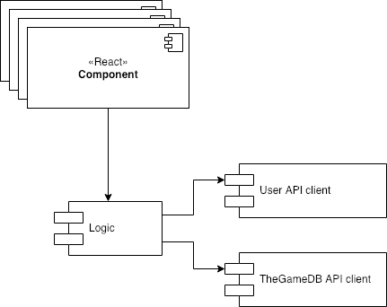
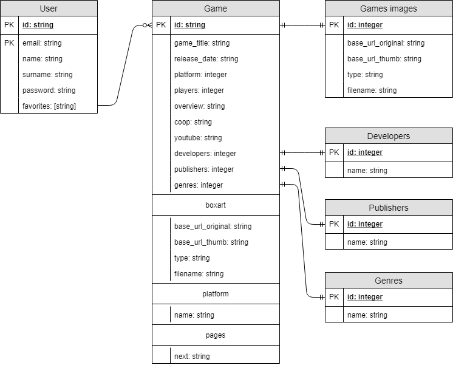
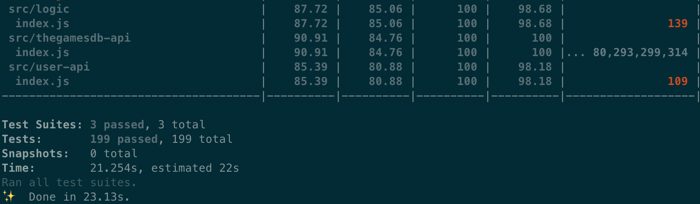

# **U**LTRA **V**ideo **G**ame **S**earch **M**achine <small>(ULTRA VGSM)</small>

<<<<<<< HEAD
 
=======
[] 
>>>>>>> 61fe3b4ce9ec0202f07fdab5ef4bbbb42241fa2f

## Introduction

ULTRA Video Game Search Machine (ULTRA VGSM) is a [SPA](https://en.wikipedia.org/wiki/Single-page_application) developed with [React](https://reactjs.org) that allows searches through the [TheGamesDB API](https://api.thegamesdb.net/#/), list by platform, and let you keep a list of favorites.

## 🚀 Environment setup

### Install the needed tools
* Clone this repository: `git clone https://github.com/robert-z/skylab-bootcamp-201901.git`
* Move to your project folder: `cd skylab-bootcamp-201901/staff/groups/la-cia-del-anillo/ultra-vgsm`
* Start the services: `$ yarn start`
* Go to the [development mode](http://localhost:3000)

## Functional Description

### Use Cases

### Flows

#### Search by name

#### Search by platform

#### Add to favorite

## Technical Description

### Blocks

### Components

### Data Model

### Code Coverage

