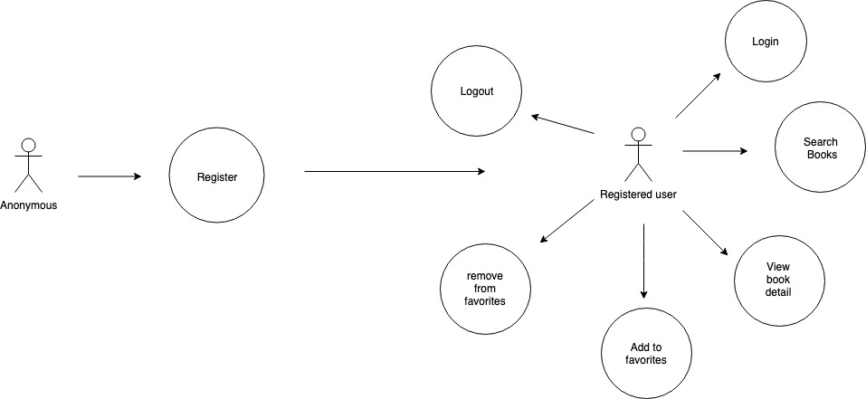
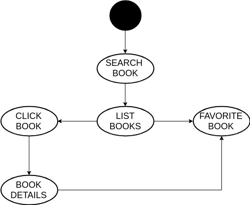
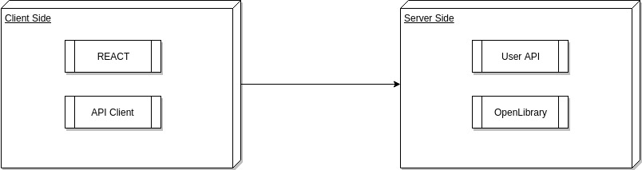
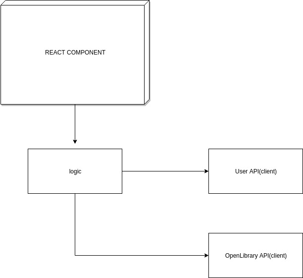
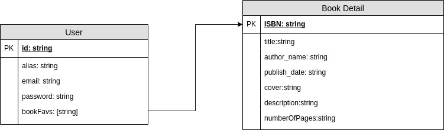

# **Skybrary**

## Introduction
***
Skybrary allows the user to search for new books and keep track of its favorite books.

## Functional Description
---
In order to use the app, users have to register.
Once they complete they registration, they can use the search bar to find new books
If they find a book they like they can add them as favorites.

### **Use Cases**

### **Flow List**
Search Book

## Technical Decription
---
### **Blocks**

### **Components**

### **Data Model**

### **Technologies**
React JS, ES6, Sass, JEST, NPM, Bulma, Font Awesome
### **Code Coverage**

We got 90% that one time the coverage wanted to work.
