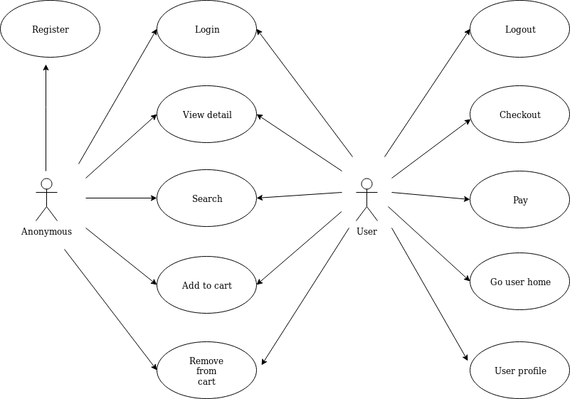
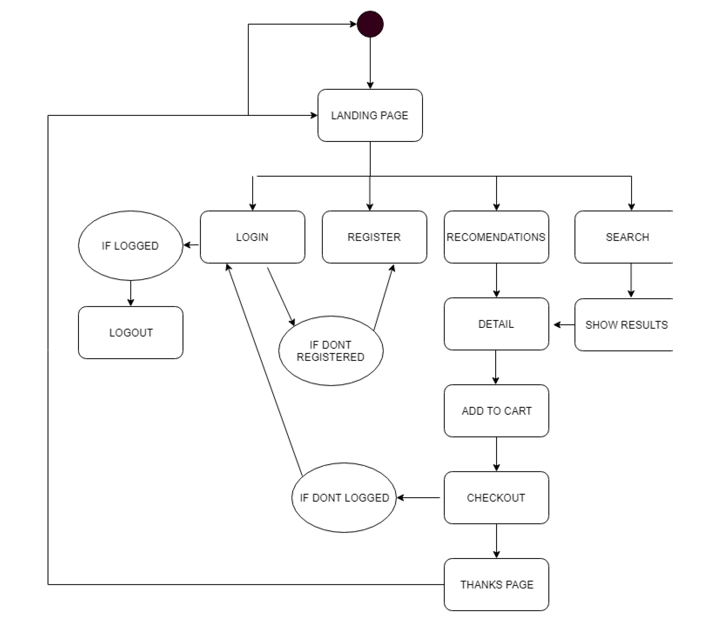
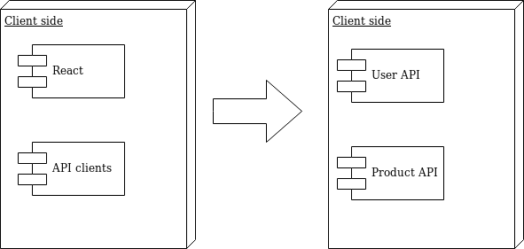
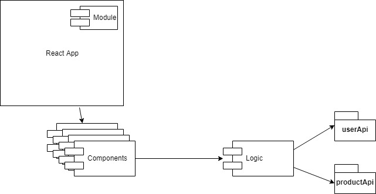
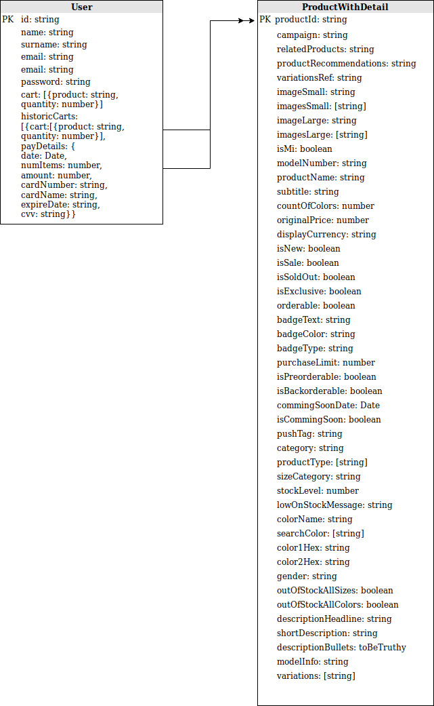
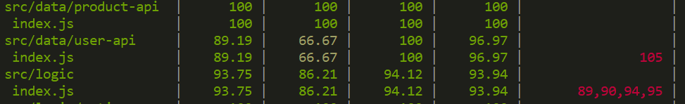

## Introduction to Nozama App

The app is an e-comerce site oriented to the sport-shoes market. Our main goal is empower people follow a healthier and happier life style.

## Functional description

  It consumes data from a custom made API to get products and manage all actions by another API. All data stored generated by the user interaction: such a buy a product, register him self, log in, log out, add to car and pay among others.

  ### Use Cases

  ### Flow Diagram

### Blocks Diagram

### Components Diagram

### Data Model

### Coverage

#### Proyect developers

* [Carlos Corredor](https://github.com/Carlos7979)
* [Pablo Rey](https://github.com/paulusrex)
* [Daniel Ferrández](https://github.com/DaniLatreCodes)

