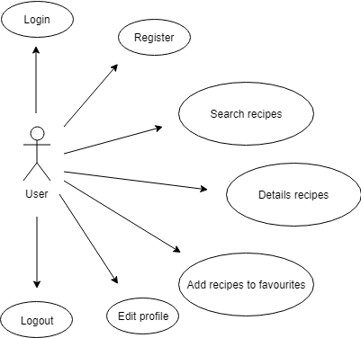
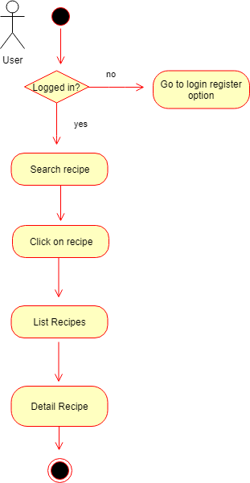
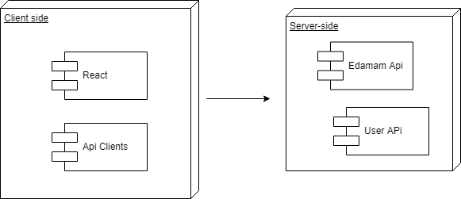
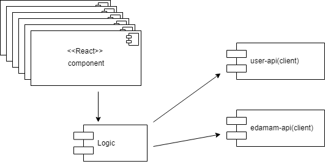
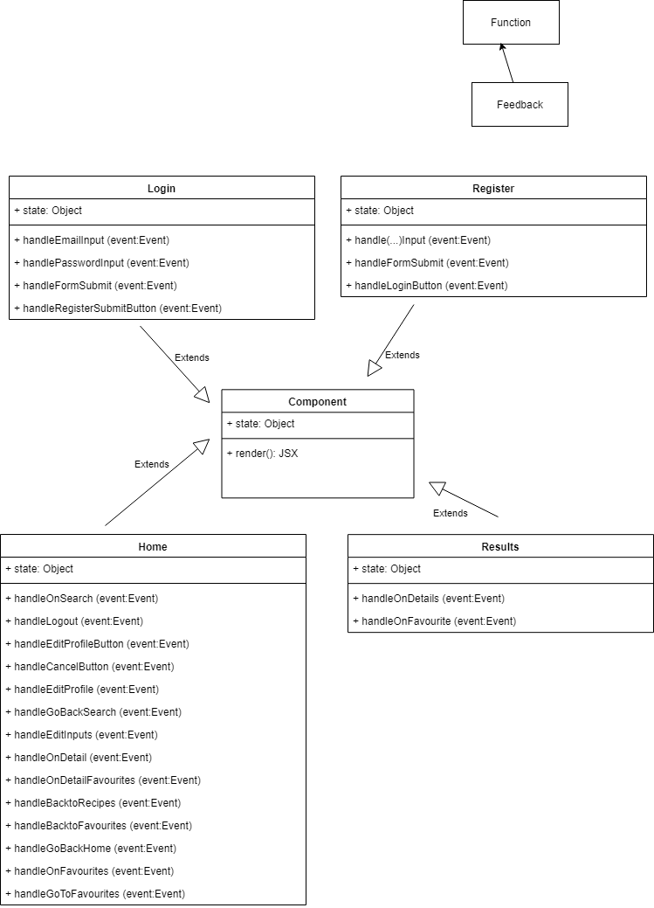
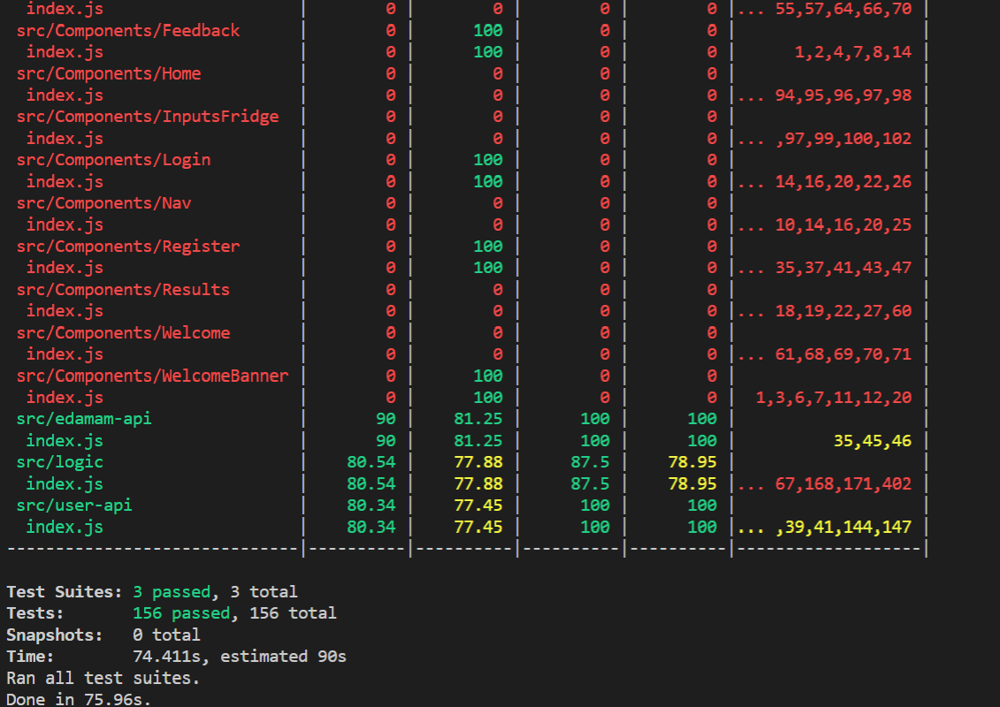

Smart-fridge

=================

## Introduction

Users will sign up with their details of their gender, age, weight, height, lifestyle(daily exercise) and the aplication calculates the amount of calories they need everyday. Then, the user would search recipes depending on what foods they have into their fridge, maximum of calories they want for recipe, kind of diet and health, and the aplication will show recipes acording to that inputs, and for every recipe, show  nutrient's percentage of calories, fats, protein and carbohidrates acording to the user,  preparation time, ingredients and directions to prepare it.

## Functional description

### Use cases

### Flows

## Technical description

### BLocks

### Components

### Class /Objects

## Data model

### Technologies

React Js, ES6

## Code Coverage

