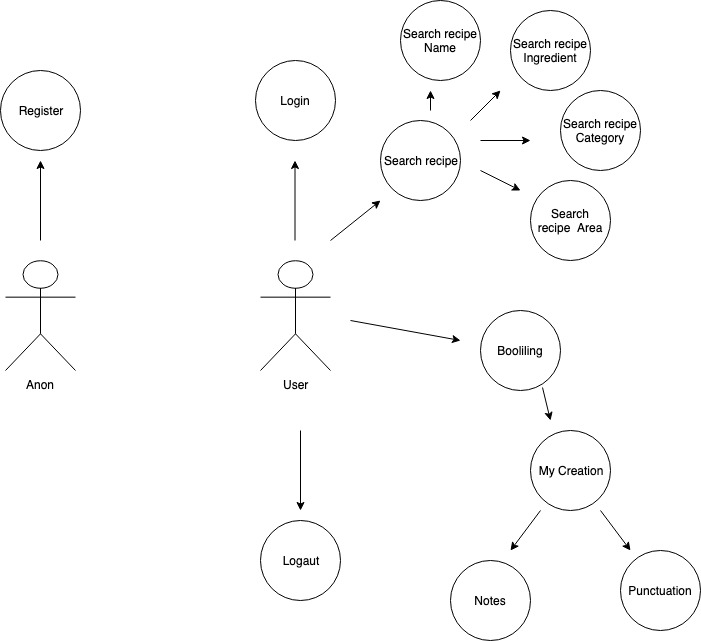
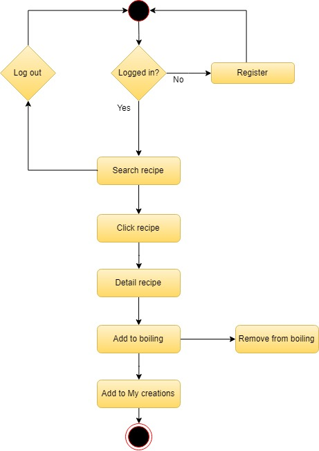
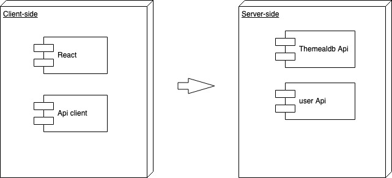
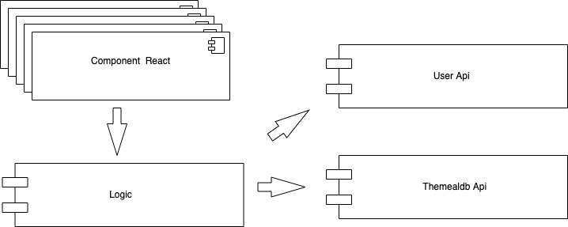
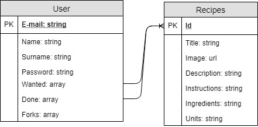
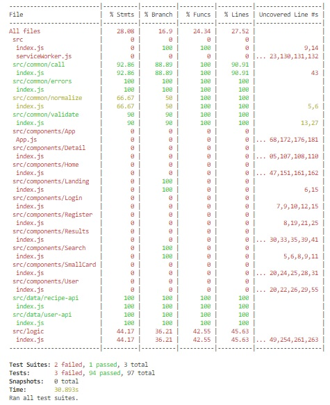

# Project name: FoodLab

You would be able to look for recipies and save them to favourites and after you have try it you will be able to rate them and let comments on them.

## APP DESCRIPTION

The aplication allows to the user shearch for recipes of different types of food. To be able to acces to the search, the user must first registrate and log in with registrated account.

Once logged in with the registrated account, the user can search for recipes by categories, ingredients or recipe name.

Once the search results have been obtained, the user have the possibility to save the recipes as favorites. The application has two types of favorites: *To cook* and *Cooked*. 

Firstly, the recipe added as favorite goes to the *To cook* favorite category, where by clicking on the COOKED button the recipe goes to the *Cooked* category.

Secondly, once the recipe is within the category  *Cooked* , the user can evaluate it and leave comments.

## Functional description

### Use cases

### Flows

## Technical description

### Blocks

### Components

## Data model

### Technologies

React Js, ES6

## Code Coverage

