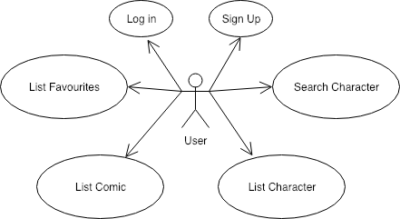

# Marvel-App React Scripts

## Introduction

The Marvel App gives you access to all Marvel database. From our App, you will be able to get all the information regarding Marvel Characters and Comics. You will also be able to star your favourite characters to have a faster access from your Favourites tab. App avaialbale in 5 languages.

## Functional Description

### Use Cases

## Technical Description

### Blocks

### Components

### Class / Objects

### Data Model

### Code Coverage

### Technologies

React JS, ES6 & CSS