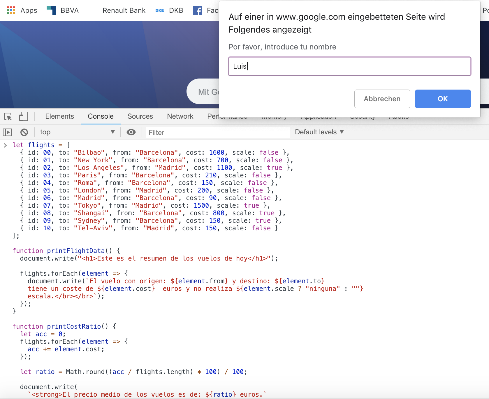
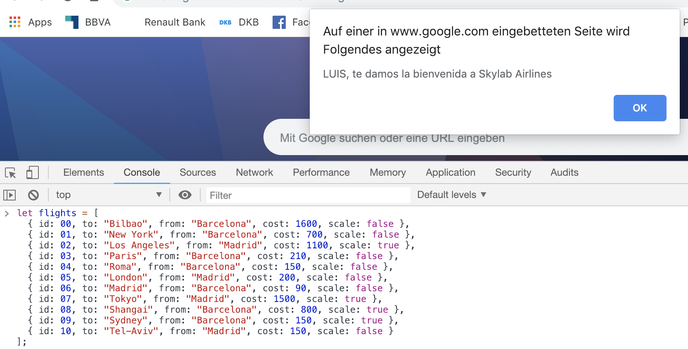

Aerolinea
=========

# Introducction

Inferfaz de usuario para una aerolínea (por terminal) que ofrece la **información de 10 vuelos** para el dia de hoy.

# Functional description

Los vuelos están declarados de forma global. Cuando se llame a la función indica los siguientes datos:

1. Se pregunta al usuario su nombre a través de un el método *window.prompt()*

2. Se le da la bienvenida que se visiualiza un texto de bienvenida a través de un *window.prompt()*

3. El usuario visualiza la siguiente información: 

    * El vuelo con origen: Barcelona, y destino: Madrid tiene un coste de XXXX€ y no realiza ninguna escala.

4. El coste medio de los vuelos

5. Cuantos vuelos efectúan escalas

6. El destino de los últimos 5 vuelos del día 


## Use cases






# Technical description

```javascript
function skylabAirlines() {
  let guessName = prompt("Por favor, introduce tu nombre");
  alert(guessName.toUpperCase() + ", te damos la bienvenida a Skylab Airlines"
  );

  printFlightData();
  document.write("<h1>Información adicional:</h1>");
  printCostRatio();
  document.write("</br></br>");
  printFlightScale();
  document.write("</br></br>");
  printLastFlightsOfDay();
}
```