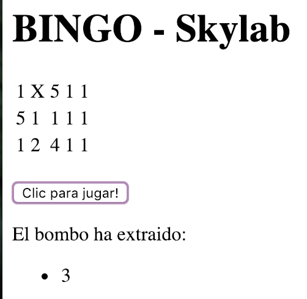

Bingo
=========

# Introducction

Programa que simula un bingo.

# Functional description

1. Cuando se ejecuta, pide el nombre del jugador y a continuación muestra un cartón con 15 números (excluyendo el 0).

2. Para empezar a jugar, el usuario debe hacer clic en el boton *"Clic para jugar!"*

3. Durannte el primer turno el programa pregunta al usuario si desea extraer un número del bombo:

    * Si coincide con alguno de los existentes en el cartón, cambia elnúmero por una "X". 
 
4. El cartón se mostra al final de cada turno, con los cambios efectuados, indicándole al usuario qué número se ha encontrado. 

***

Cuando todos los números de una misma linea están en "X",mostra el mensaje "LINEA!". Sin embargo, el juego solo acabará cuando todos los números estén marcados con "X".


**Al concluir**:

Al conlcuir el juego indica al usuario en cuantos turnos ha completado el cartón. 

## Use cases





# Technical description

```javascript
function bingo() {
    initializePlayer();
    initalizeGame();
}

bingo()

```