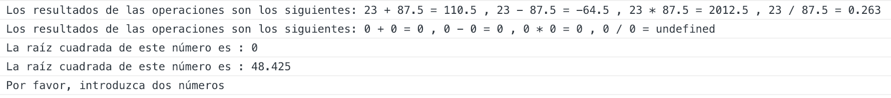

Calculadora
=========

# Introduction

Visualiza por consola la suma, resta, multiplicación y división entre dos números.

# Functional description

*Carcteristicas especiales*

* El resultado se muestra con 3 
decimales (en caso de que hubieran). 

* Contempla y actuar correctamente en el caso de introducir cualquier cosa 
que no sean números.

* Si se introduce un solo número, muestra solo la raíz cuadrada. 

* Los resultados se almacenan dentro de una array y se muestran de forma amigable al usuario


## Use cases




# Technical description

```javascript
function calculator(num1, num2) {
    if (Number.isFinite(num1) && num2 === undefined) {
        return 'La raíz cuadrada de este número es : ' + Math.round(Math.sqrt(num1) * 1000) / 1000;
       } else if (isNaN(num1) || isNaN (num2)) {
          return 'Por favor, introduzca dos números';
       }
    
    result = [];
    let a = prettyAdd(num1, num2);
    result.push(a);
    let b = prettySubstraction(num1, num2);
    result.push(b);
    let c = prettyMultiply(num1, num2);
    result.push(c);
    let d = prettyDivision(num1, num2);
    result.push(d);

    return 'Los resultados de las operaciones son los siguientes: ' + result.join(' , ')
};

```