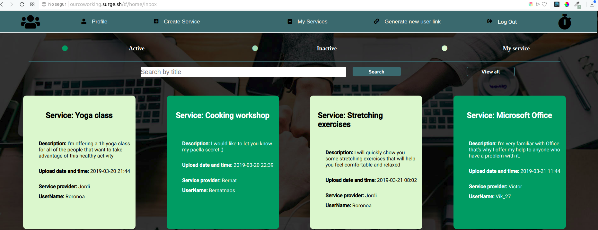
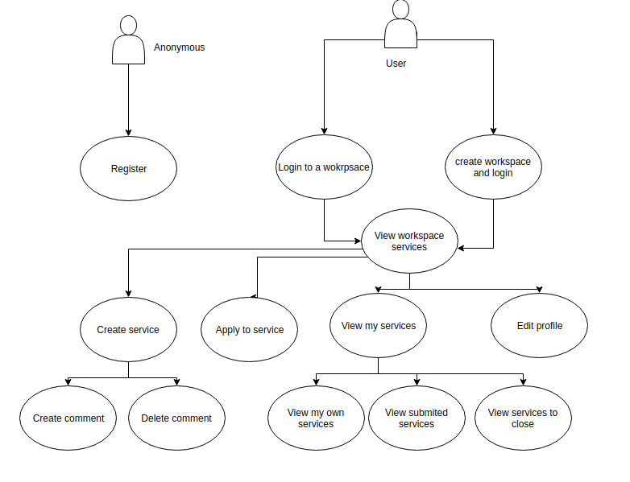
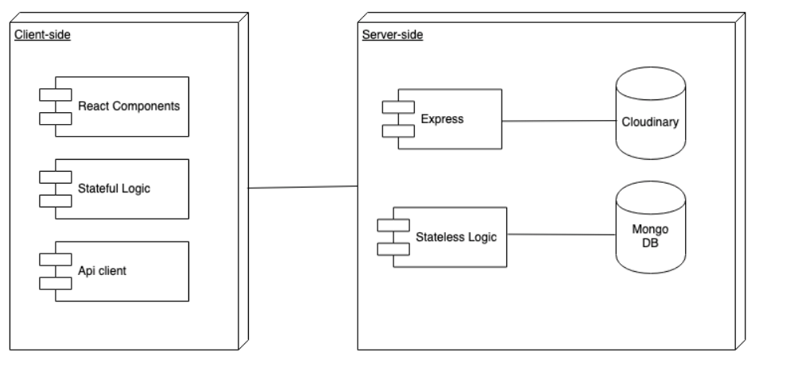
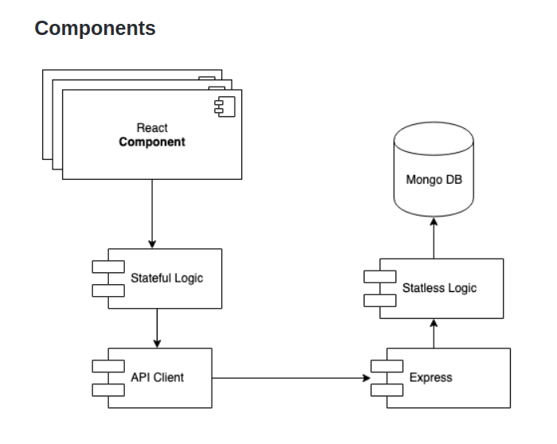
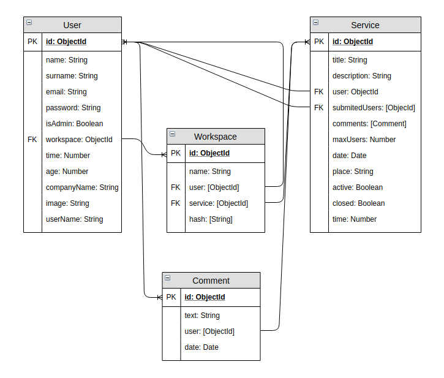
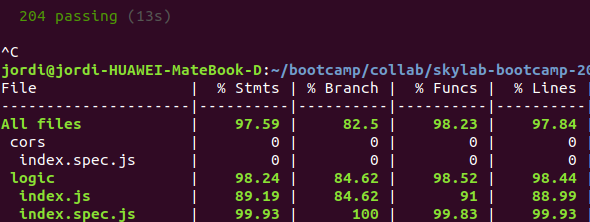
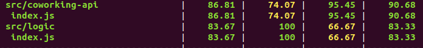

# OurCoworking app

## Introduction

The main goal of this app is to achieve people working in the same coworking to know each other better.
This will make the time they spend in the office more enjoyable as well as increase their potential and efficiency while working as they will receive more help from their office colleagues.

## Functional description

Users can:

* Create a workspace or receive a link from an admin where they will login automatically in the workspace and get linked to it permanently unless the admin removes (unlink) it from the workspace.
* Check and/or edit their profile.
* View other members profile.
* Create services based in their knowladge or abilities and publish them in the workspace.
* Apply to other workspace services.
* View applied services, own services or services that may be closed.
* Create, view and/or delete all comments they've written.
* If admin, generate link invitation per new users.

Only registered users can access the platform's content.

### Use Cases

### Blocks

### Components

### Data Model

### Code Coverage

#### API Coverage

#### APP Coverage

### Technologies
Javascript, ReactJS, Node.js, Express, MongoDB & Mongoose.
