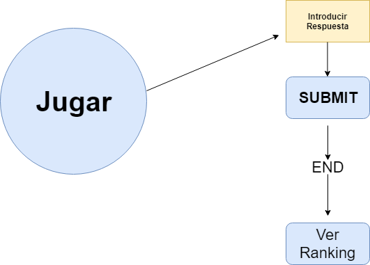

# Calculadora

## Introduction

Representa el juego de pasapalabra
   

## Functional description

Se muestra en pantalla una descripcion y debes introducir la respuesta.

Si es **correcta** se resaltara el color de la letra en *verde* y si es **incorrecta** se resaltara el color de la letra en *rojo*

Si introduces **1** numero te calcula la raiz cuadrada.
   
### Use cases

Lorem ipsum ...

## Description
Su funcionamiento debe parecerse al juego de [Pasapalabra](https://www.telecinco.es/pasapalabra/ "Pasapalabra tv5")
