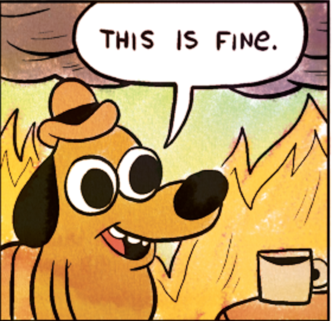
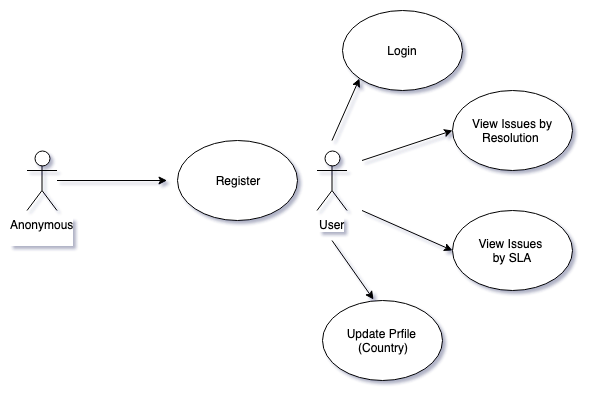
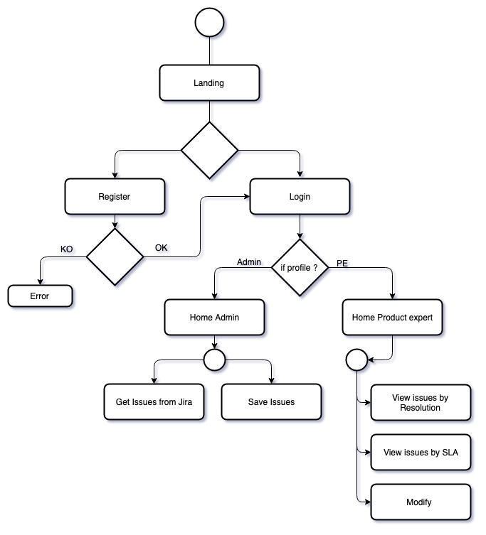
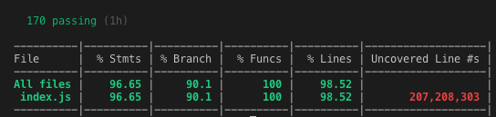
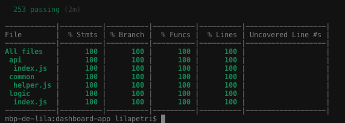

# Dashboard Issues

## Description
````
Dashboard Issues is a dashboard which reads and process information about HotFix, BugFix, Bug and Request from Jira and shows aggregated information by country and issue type.
In every chart you will be able to see amount of issues overdue versus  issues resolved ontime, or issues by resolution type

What's a hotfix? 
A hotfix is a term used to describe a vital fix in software which must be solved as soon as possible. A hotfix is always encountered by all or almost all the users who use the feature. 
Once a hotfix is reported, our team will start working on them immediately after they are discovered and they will dedicate all the resources necessary. They'll stop other ongoing tasks and focus on solving this issue instead.  

What's a bugfix? 
 A bugfix is an urgent bug in the main functionality for which there isn’t a workaround, and blocks, crashes or causes a disruption. This means that the feature or functionality the user is working with can not be used in any way . This kind of issue could only affect one user. The SLA in bugfix will be 3 day.

What's a normal bug?
A normal bug is a problem in the main functionality. It is usually encountered by some of the users who use the feature and a bug can wait for the next release to be fixed.  This kind of bug should be solved within the normal course of development. The SLA in normal bugs will be 1 week.

What's a request? 
A request is not a problem in the software, it is a demand from the Product Expert or someone else that has to be done by a technical expert, e.g a database query. The SLA in request will be 7 day.  
````

## Planning

Trello: [https://trello.com/b/dPd4s6vR/dashboardissues](Trello) to see my planning.

## Functional Description

### Use Cases



### Flow



## Technical Description

### Block

### Components

### Class/ Objects

### Data Model

### Coverage
##### Server Side


##### Client Side

