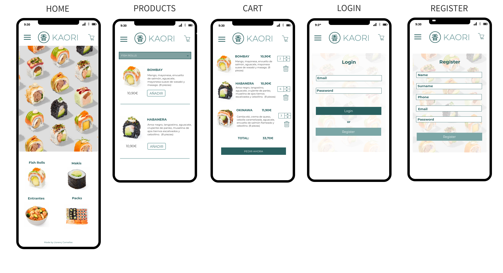
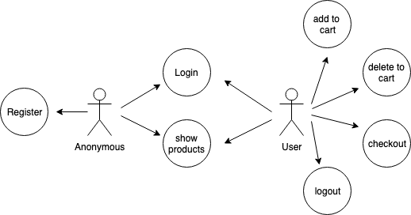
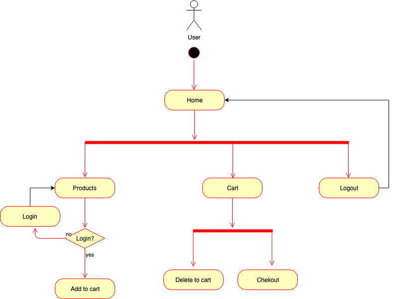
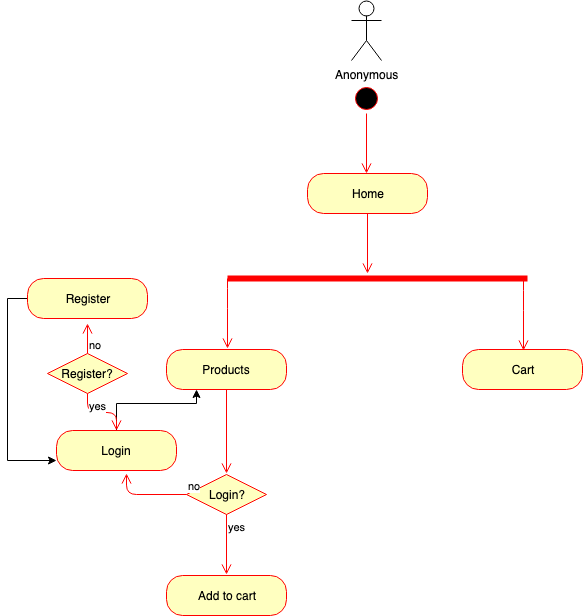
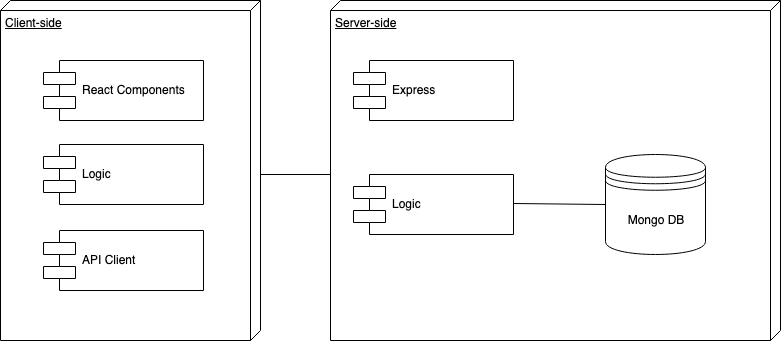
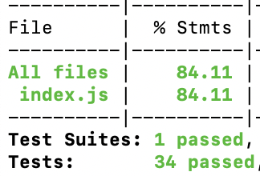
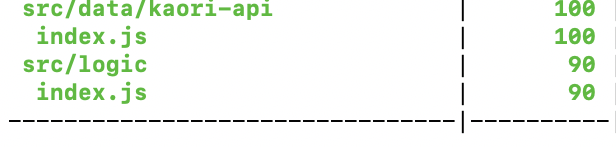

# KAORI

## Introduction
Kaori is an app to order sushi online. Using this app you will be able to have a look at the menu, add the products to the cart and order.

Wireframe:

## Functional description

### Use Cases

### Flowcharts
User:

Anonymous:

## Technical Description

### Blocks

### Components

### Data Model

### Code Coverage
Api Coverage:

Api Coverage:

### Technologies

Javascript, ReactJS, Node.js, Express, MongoDB & Mongoose.

### TODO
- Desktop version
- Number of products in the cart
- Add and delete products from the cart
- Use hooks

### Planning

[Trello](https://trello.com/b/jweGRSTa/kaori)

