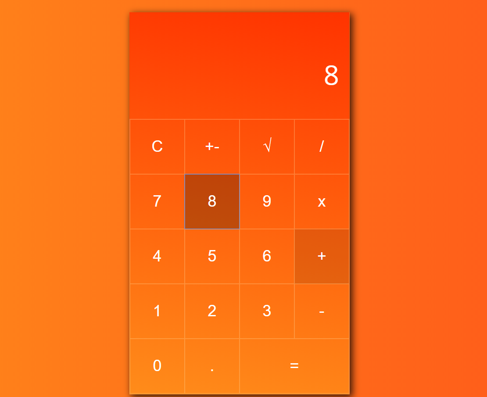

# Calculadora HTML + CSS + JS ➗➕

Mini-Proyecto del tema 7 - [ver ejercicio en GitHub](https://github.com/SkylabCoders/precourse/blob/master/projects/project7.md)

## Ejercicio

Mediante HTML y CSS realizar una calculadora.

## Functional description

Work in progress