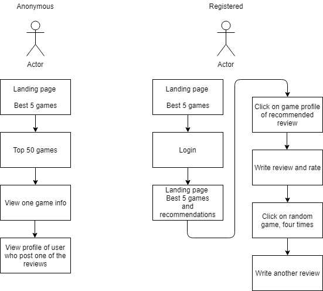
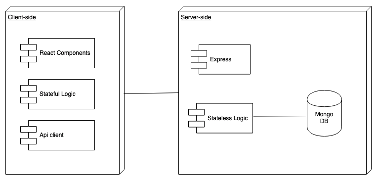
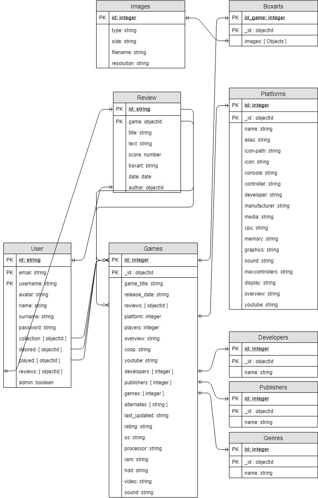

## Introduction
---
Project Z is a videogame database where you can search, rate the games you play, and find videogames recommendations based on users similars to you, and your favorites genres, platforms and developers.

## Use Cases Diagrams

---

## Block Diagram

---

# Components

---

# Data Model

