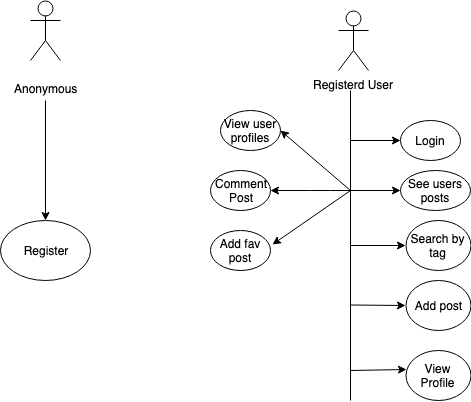
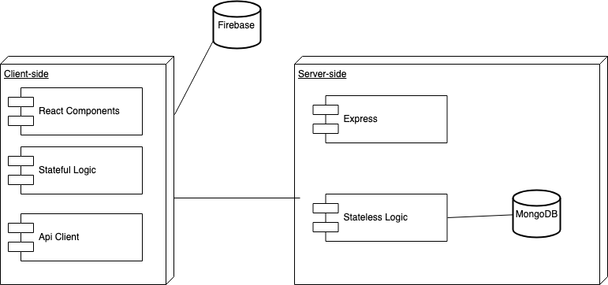
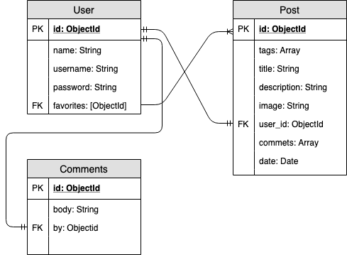

# InstaFood app

## Introduction

Intagram style app abaout food where the user can upload their publications, save publications, search by hashtag, comment on posts of other users and see their profiles.

## Functional description

Users can:

- Create post with a title, description and upload an image.
- See other user profiles.
- Comment other users posts.
- Save other users posts.
- See how many times have your post has saved as favorite by other users.
- Delete a post.
- See how many posts have a user.

Only registered users can access the platform's content.

### Use Cases

## Technical Description

### Blocks

### Components

### Data Model

### Code Coverage

#### 

#### 

### Technologies

Javascript, ReactJS(Hooks), Node.js, Express, MongoDB & Mongoose, Firebase.
