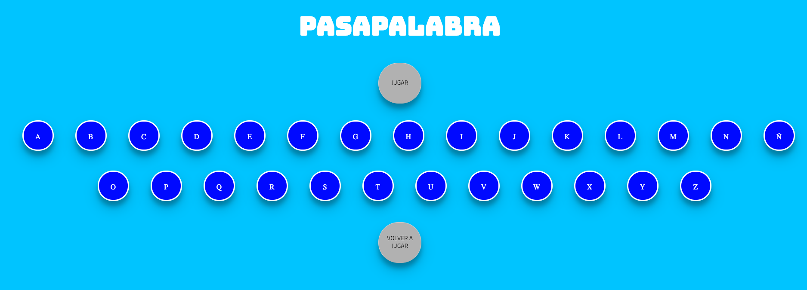
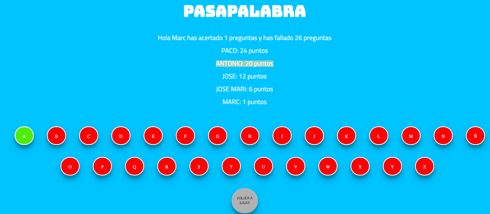

# Pasapalabra

## Introduction

Mítico juego del pasapalabra hecho en JS, HTML y CSS

## Functional description

El juego hace una pregunta por cada letra del alfabeto, al final del juego, y habiendo respondido todas las letras, indica al usuario cuantas letras ha fallado y cuantas ha acertado. Si el usuario responde con "pasapalabra" el juego detectará que el usuario no responderá esa pregunta, y no estará acertada ni fallada, la dejará para la siguiente ronda. El juego cuando finaliza, muestra un ranking de usuarios con el nombre y ordenados por cantidad de letras acertadas.




## Technical Description

Toda la lógica se ha distribuido en diferentes funciones que resuelven cada una de las condicions que requiere el juego.

- Función principal que llama a varias funcions para inicializar el juego.

```javascript
function pasapalabra() {
  getPlayer();
  showQuestionsContainer();
  showQuestion();
```

- Función para solicitar el usuario.

```javascript
function getPlayer() {
  player = prompt("Inserta tu usuario");
}
```

- Funcíon para esconder el botón jugar y mostrar el panel con las preguntas.

```javascript
function showQuestionsContainer() {
  document.getElementById("play").classList.add("hidden");
  document.getElementById("question-container").classList.remove("hidden");
}
```

- Función que muestra las preguntas.

```javascript
function showQuestion() {
  document.getElementById("answer").value = "";
  var question = questions[questionNum];
  if (question.status !== 0) {
    nextQuestion();
  } else {
    var text = question.text;
    document.getElementById("question").textContent = text;
  }
}
```

- Función que valida si la pregunta es correcta y pinta el círculo verde o rojo.

```javascript
function validateQuestion() {
  var letter = questions[questionNum].letter;
  var correctAnswer = questions[questionNum].answer.toLowerCase();
  var userAnswer = document.getElementById("answer").value.toLowerCase();
  if (correctAnswer === userAnswer) {
    document.getElementById(letter).classList.add("correct");
    questions[questionNum].status = 1;
    succes++;
  } else {
    document.getElementById(letter).classList.add("incorrect");
    questions[questionNum].status = 2;
    failed++;
  }
  nextQuestion();
}
```

- Función que comprueba si el juego ha terminado llamando a la función getFinished y si no es así pasa a la siguiente pregunta.

```javascript
function nextQuestion() {
  var isFinished = getFinished();
  if (isFinished) {
    showResult();
  } else {
    questionNum++;
    if (questionNum >= questions.length) {
      questionNum = 0;
      turn++;
    }
    showQuestion();
  }
}
```

- Función que comprueba si el jugador a ha llegado al turno 3 y si es así finaliza el juego.

```javascript
function getFinished() {
  var finished = true;
  if (turn < 3) {
    finished = false;
  }
  return finished;
}
```

- Función que muestra la puntuación del jugador.

```javascript
function showResult() {
  document.getElementById("question-container").classList.add("hidden");
  document.getElementById("result-container").classList.remove("hidden");
  document.getElementById("result").textContent =
    "Hola " +
    player +
    " has acertado " +
    succes +
    " preguntas y has fallado " +
    failed +
    " preguntas";
  leaderBoard();
}
```

- Función que inserta los usuarios con las clasificaciones y los muestra en pantalla.

```javascript
function leaderBoard() {
  document.getElementById("result-container").classList.remove("hidden");
  for (var i = 0; i < 4; i++)
    var usersGame = [
      { user: "PACO", puntos: 24 },
      { user: "JOSE", puntos: 12 },
      { user: "ANTONIO", puntos: 20 },
      { user: "JOSE MARI", puntos: 6 }
    ];

  function userList() {
    usersGame.push({ user: player.toUpperCase(), puntos: succes });
    var orderPoints = usersGame;
    orderPoints.sort(function(b, a) {
      return a.puntos - b.puntos;
    });
    orderPoints.forEach(user => {
      var participant = document.createElement("p");
      participant.innerHTML = user.user + ": " + user.puntos + " puntos";
      var result = document.getElementById("result-container");
      result.appendChild(participant);
    });
  }
  userList();
}
```
