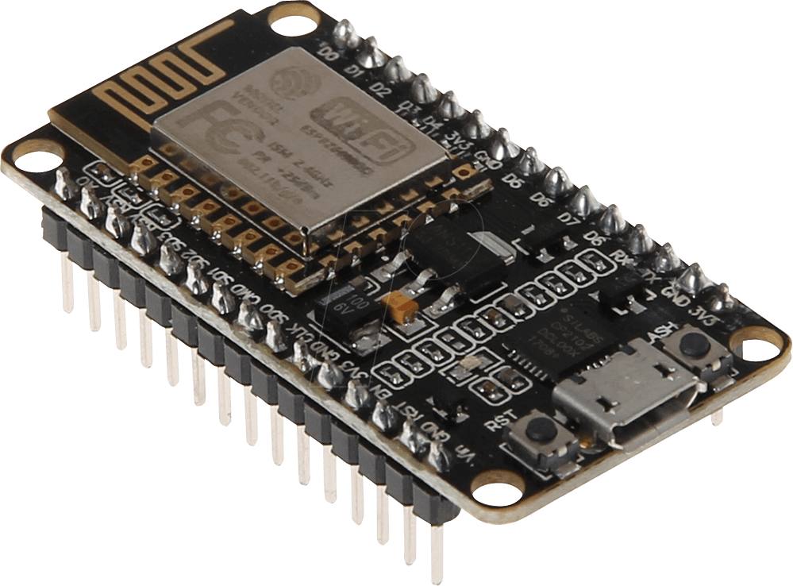
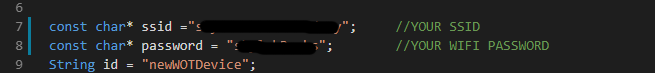
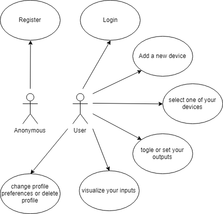
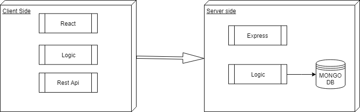
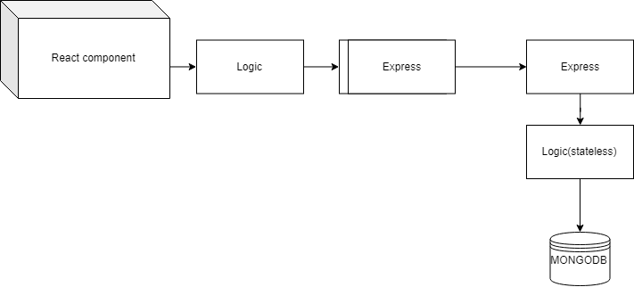
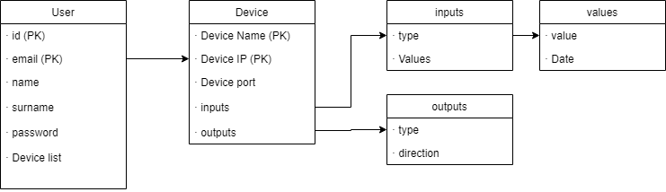
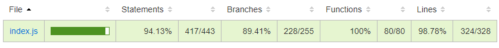
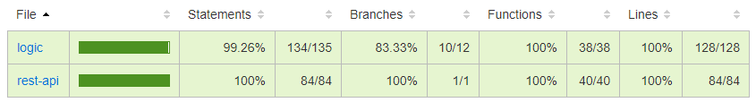

# WOTcontrol

## Introduccion

easily connect your nodeMCU arduino based devices to an app to monitor and control its inputs and outputs.

Once you logged in to the app, you can add or delete as many devices as you want and monitor and/or controle it through the web application.

## Before you start

To set up a device you should have a nodeMCU board and a micro usb cable and the arduino IDE installed and ready to download code to an arduino board.

First, download the code from the nodeMCU board [here](../../WOT-arduino/wotdevice)

befor upload the code to the board you should introduce your SSID and password.

once you set your SSID and ip and uploaded your board, you shoul connect it to a serial monitor for first time to see what ip the board have. The board usually allways mantains the same ip. so, once you know the devices IP you shoulb be able to disconect it from the serial monitor ahnd plug it whaterver you want allways under the same networf of the server.

# Functional Description

Users can:

- Add as many devices as you have into your network, with an unique device name, the corresponding device IP and port, and a refresh time
- load any of your devices in your home page and see the inputs state or control the different outputs
- Control a 3 servo robot through sliders
- Toggle two digital outputs
- Set two motors speed through sliders
- view the analog input trough the grap bar
-view the state of the two digital inputs

## Use cases

## Technical Description

### Blocks

### Components

### Data Model

### Code Coverage

#### Api coverage

#### App coverage

### Technologies

Arduino, Javascript, ReactJS, Node.js, Express, MongoDB & Mongoose.

# Future Releases

- Improve documentation about devices and connections

- Real time digital inputs refresh.

- capability of doing some simple scripts to send order concatenation to devices.

- Admin and user accounts, admin can add and delete devices and configure the diferent inputs and ouputs. User can only visualize what admin has configured.

- User configurable inputs and ouputs for every device.

- More input and ouput types (temperature sensors, proximity sensors...).

- implement a bridge local server with Raspberry pi and deploy the main server to heroku.

- Other devices compatibility.
