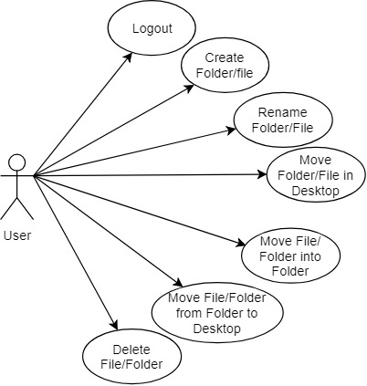
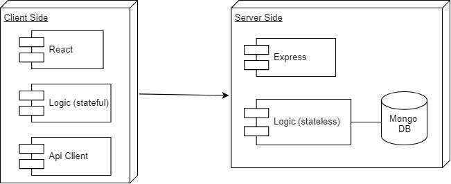
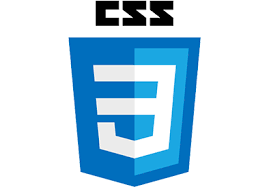

# OSI

## Introduction

Abstraction of an Operative System Interface, focuses on the management of files and folder with it's filesystem.

## Functional Description

The Logged user has it's own Desktop, where he/she is able to create "note-like" files and store them in folders. The user can arrange the folders and files with a Drag & Drop in desktop at his will, thus simulating a filesystem.

The user also has a clock and a toolbar embedded in desktop. With the toolbar you to create a folder, create a file, open finder and logout.

### Use cases

## Technical Description

### Blocks

## Data Model

## Code Coverage

N / A

## Technologies

