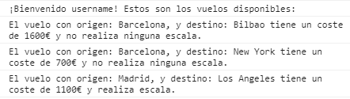

Aerolinea
=========

## Introduction

Airline simulator containing 11 flights.

## Functional description

Once you enter your username the program will greet you and show you the different flights available, including their origin, destination, price and if they have any stopover.

### Use cases

A part of the program showing the greeting and a few flights:

## Technical description

Technologies:

- [**Javascript**](https://developer.mozilla.org/es/docs/Web/JavaScript)

- [**VSCode**](https://code.visualstudio.com/docs)