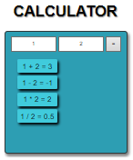

Calculadora
=========

## Introduction

Simple Calculator web app.

## Functional description

Simple calculator with two **placeholders** where the user has to put the two numbers to calculate. On "**Click**" in the "**=**" button it will show the **sum**, **rest**, **division** and **multiplication** of the two numbers. If only one number is input it will show the **square root** of this.

### Use cases

Image showing the basic layout of the program with some numbers in it:

## Technical description

Technologies:

- [**Javascript**](https://developer.mozilla.org/es/docs/Web/JavaScript)

- [**HTML**](https://developer.mozilla.org/es/docs/Web/HTML)

- [**CSS**](https://developer.mozilla.org/es/docs/Web/CSS)

- [**VSCode**](https://code.visualstudio.com/docs)