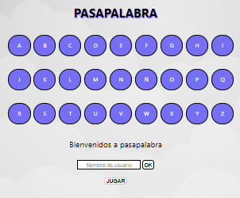

Pasapalabra
=========

## Introduction

"**Pasapalabra**" game simulator.

## Functional description

On username input and "**Click**" on "**JUGAR**" the program shows a question and a **placeholder** for an answer appears. Each letter of the layout represents a question, if the question is answered correctly the corresponding letter's background color changes to **green**, if answered incorrectly it changes to **red**. If the input in the **placeholder** is "**pasapalabra**" the ongoing question will be skipped until the next round starts (all letters are passed). Once the game is finished it will show a **ranking** with the users points.

### Use cases

Image showing the basic layout of the program:

## Technical description

Technologies:

- [**Javascript**](https://developer.mozilla.org/es/docs/Web/JavaScript)

- [**HTML**](https://developer.mozilla.org/es/docs/Web/HTML)

- [**CSS**](https://developer.mozilla.org/es/docs/Web/CSS)

- [**VSCode**](https://code.visualstudio.com/docs)