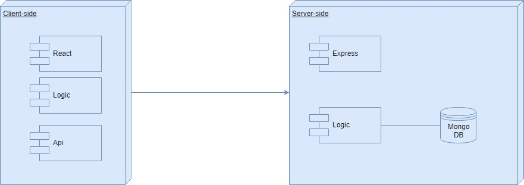
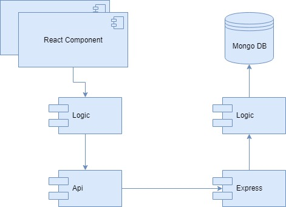
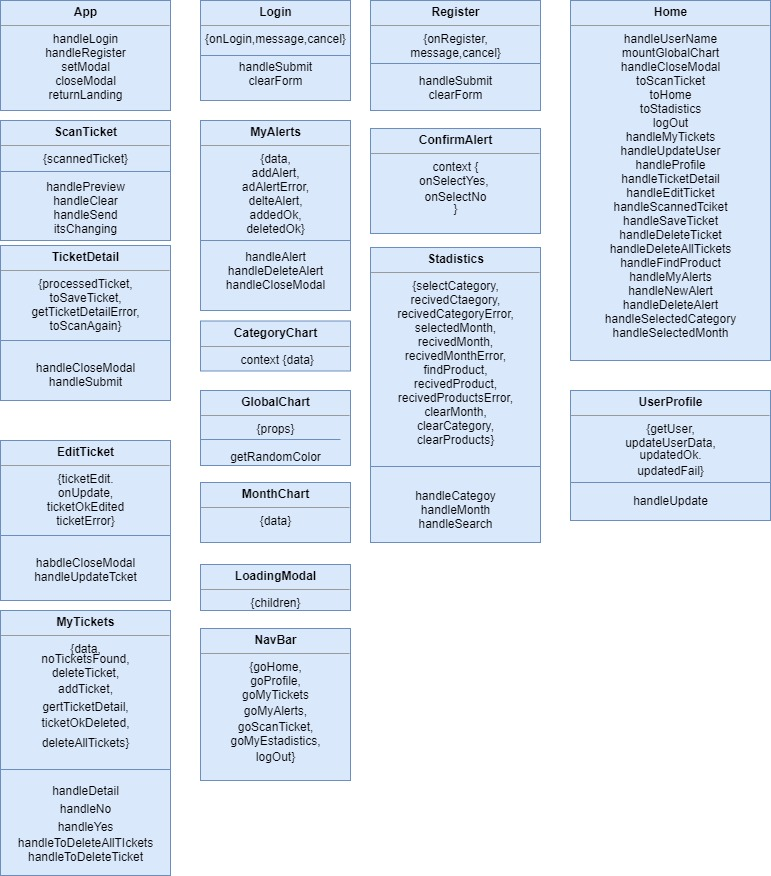
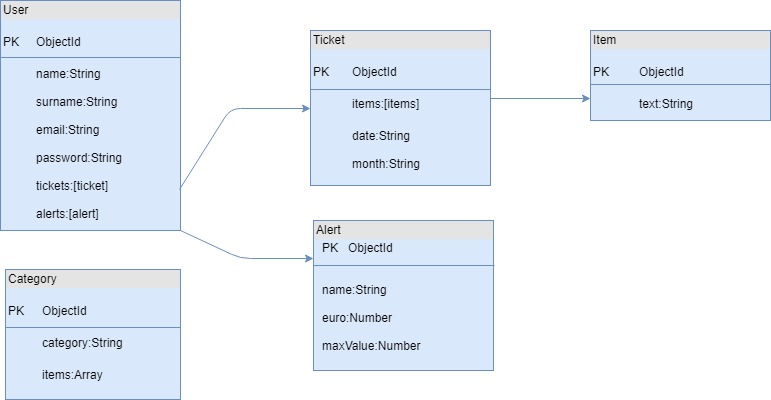
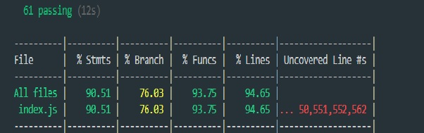

# AllMyCents App

## Introduction

With AllMyCents you can scan your supermarket tickets and keep in track your

consumption information , managging your tickets , adding alerts and much more !

# Functional description

Registered users can :

- Scan ticket (edit , save ,discard)
- Manage tickets (edit /delete) 
- Manage alerts (add/delete)
- Check consumption by: (Category , Month , Product)

## Use cases

## Flowchart

### User

# Technical description

## Blocks

## Components

## React components

## Data model

#Code coverage

# For future versions

- Mobile version
- User will be able to  add an item  into his own private list of items
if there is no coincidence with the data base items list
- User will be able to create his own categories 
- User will be able to filter tickets by date
- User will be able to filter tickets by Supermarket brand
- Alerts notifications will be displayed on navbar by an incon 
